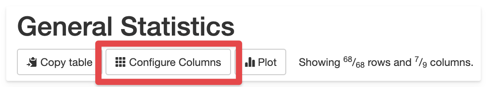
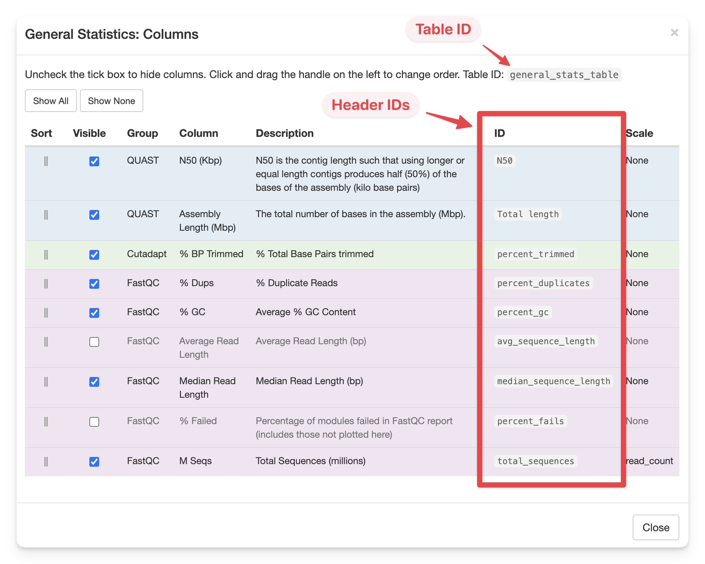

# Customising Reports

MultiQC offers a few ways to customise reports to easily add your own
branding and some additional report-level information. These features
are primarily designed for core genomics facilities.

Note that much more extensive customisation of reports is possible using
[custom templates](../development/templates.md).

## Titles and introductory text

You can specify a custom title for the report using the `-i`/`--title`
command line option. The `-b`/`--comment` option can be used to add a
longer comment to the top of the report at run time.

You can also specify the title and comment, as well as
a subtitle and the introductory text in your config file:

```yaml
title: "My Title"
subtitle: "A subtitle to go underneath in grey"
intro_text: "MultiQC reports summarise analysis results."
report_comment: "This is a comment about this report."
```

Note that if `intro_text` is `None` the template will display the default
introduction sentence. Set this to `False` to hide this, or set it to a
string to use your own text.

### Report time and analysis paths

It's not always appropriate to include the file paths that MultiQC was run with
in a report, for example if sharing reports with others outside your organisation.

If you wish, you can disable the analysis paths and/or time in the report header
with the following config parameters:

```yaml
show_analysis_paths: False
show_analysis_time: False
```

## Report Logo

To add your own custom logo to reports, you can add the following
three lines to your MultiQC configuration file:

```yaml
custom_logo: "/abs/path/to/logo.png"
custom_logo_url: "https://www.example.com"
custom_logo_title: "Our Institute Name"
```

Only `custom_logo` is needed. The URL will make the logo open up
a new web browser tab with your address and the title sets the mouse
hover title text.

## Project level information

You can add custom information at the top of reports by adding key:value
pairs to the config option `report_header_info`. Note that if you have
a file called `multiqc_config.yaml` in the working directory, this will
automatically be parsed and added to the config. For example, if you have
the following saved:

```yaml
report_header_info:
  - Contact E-mail: "phil.ewels@seqera.io"
  - Application Type: "RNA-seq"
  - Project Type: "Application"
  - Sequencing Platform: "HiSeq 2500 High Output V4"
  - Sequencing Setup: "2x125"
```

Then this will be displayed at the top of reports:


Note that you can also specify a path to a config file using `-c`.

## Listing software versions

If a software tool prints its version number in log output, MultiQC
attempts to find this information and print it in reports
(see [Saving version information](../development/modules.md#saving-version-information))
for module developer documentation.
However, not all tools make version information available in their log files.
Additionally, some situations may require bespoke version number reporting,
for example if software is found within multiple scopes in an analysis pipeline.

In these cases, you can manually add software version information to a report.
This can be done in two different ways: by adding them in to the MultiQC configuration,
or by creating stand-alone YAML files with specific filenames and formats.

Both methods have the same syntax for the YAML configuration, with the exception
of MultiQC configuration files requiring a top-level `software_versions`.
The examples below are for a MultiQC config file.

:::info
If a provided software name exactly matches the name of a module that ran
(case insensitive), then the version number(s) will be shown alongside the
section heading. All software versions will be printed at the bottom of the report.
This is the same behaviour as version numbers found within log files.
:::

### Option 1: Dictionary of software name and version pairs

The simplest way to provide version numbers to give names and versions:

```yaml
software_versions:
  samblaster: "0.1.24"
  quast: "5.2.0"
```

:::danger
Make sure that you write the version in quotes to ensure it being
interpreted as a string. For example, a version `1.10` without
quotes would be parsed as a float and displayed as version `1.1`.
:::

If you have run a tool multiple times and have multiple software versions,
you can provide a list of versions:

```yaml
software_versions:
  samblaster: "0.1.24"
  quast:
    - "5.2.0"
    - "5.1.0"
```

### Option 2: Grouping softwares and versions

In more complex scenarios, you may have multiple version _names_ that you
want to group. For example, a tool that wraps other tools, or
listing software version numbers grouped by analysis pipeline step.

Here, input is provided as a nested YAML dictionary with three levels:
`group` -> `software(s)` -> `version(s)`.

```yaml
software_versions:
  samtools:
    samtools: "1.11"
    htslib: "1.3"
  quast:
    quast:
      - "5.2.0"
      - "5.1.0"
```

```yaml
software_versions:
  analysis_stage_1:
    samtools: "1.3"
    htslib: "1.3"
  analysis_stage_2:
    samtools: "1.11"
    htslib: "1.11"
  analysis_stage_3:
    quast:
      - "5.2.0"
      - "5.1.0"
```

If a group and software have the same name (eg. `samtools` -> `samtools`),
the software name will not be repeated in the section header.

### Software versions YAML file

If you prefer to provide versions in a separate YAML file, MultiQC will also
look for filenames ending in `*_mqc_versions.(yml|yaml)` in your search path,
for example `rnaseq_mqc_versions.yml` or `mapping_mqc_versions.yaml`. The
content of these YAML files should be a YAML dictionary, similar to the
previous examples but without the top level `software_versions`. For example:

```yaml
samblaster: "0.1.24"
quast:
  - "5.2.0"
  - "5.1.0"
some_other_tool: "2023-1"
```

If multiple YAML files are found the content of these will be merged
together.

### Disabling automatic versions

In some applications, such as a pipeline workflow, you may wish to _only_ include
version information defined in the config file or in a separate YAML file. For
this, it possible to disable parsing versions from the log file through the
following config option:

```yaml
disable_version_detection: true
```

### Disabling software version report section

If you like, you can remove the _Software Versions_ report section.
Software versions will still be shown inline with the headings, where possible.
To do this, use the following config option:

```yaml
skip_versions_section: true
```

Note that setting this in combination with manually added version numbers
could lead to versions not being included within the report.

### Customize software versions table header

In the _Software Versions_ report section the default table header for the column, listing groups of software, is "Group". This can be changed by setting the config option `versions_table_group_header` to your desired header name. For example:

```yaml
versions_table_group_header: "Analysis Pipeline Step"
```

## Sample name replacement

Occasionally, when you run MultiQC you may know that you want to change the resulting
sample names at run time. You can do this using the `--replace-names` option, which
allows you to change sample names during report creation.

Unlike `--sample-names` below, the original names never make it through to the report.
This can be useful if you know that you have a range of outputs that result in varying
sample names but want to create a consistent report - especially if you want
samples to line up properly in the _General Statistics_ table.

To use, create a tab-separated file with two columns. The first column contains the
search strings and the second the replacement strings:

```
IDX102934	Sample_1
IDX102935	Sample_2
IDX102936	Sample_3
```

Note that by default, _partial_ matches are replaced. So if a log file gives a sample
name of `IDX102934_mytool` then the result will be `Sample_1_mytool`.
There are two config options to fine-tune this behaviour:

Setting `sample_names_replace_exact` to `True` in a MultiQC config file will tell
MultiQC to only change a sample name if the pattern _fully_ matches the search string.
In the above example, `IDX102934_mytool` would remain unchanged.

Setting `sample_names_replace_complete` to `True`, the replacement string will be used
as a complete replacement if the search pattern matches at all.
In the above example, `IDX102934_mytool` would become `Sample_1`.

:::warning
Use this method with caution! If aggressive cleaning of sample names results in
multiple samples with identical identifiers, they will be overwritten.
:::

To have more control over replacements, you can use regular expressions.
If you set `sample_names_replace_regex` to `True` in a MultiQC config file
and then create a file that contains regex search strings and even Python regex
group identifiers in the replace string. For example:

```
SAMPLE(\d)_([PS]E)_(\d)	XXX_\1_\2_\3
```

With this file, `SAMPLE1_PE_2` would be renamed to `XXX_1_PE_2`.
`SAMPLE3_SE_4` would be renamed to `XXX_3_SE_4`.

Setting `sample_names_replace_exact` to `True` also works for regular expression
searches. The code uses the `re.fullmatch` function, so no `^` or `$` anchors are needed.

Setting `sample_names_replace_complete` is ignored when using regexes.
If you want this behaviour then configure your regular expression to match the entire string.
For example, `*(\d)_([PS]E)_(\d) \1_\2_\3` would rename `SAMPLE1_PE_2` to `1_PE_2`.

Finally, if you prefer not to use `--replace-names` with a TSV file, you
can set the search patterns in a MultiQC config file directly.
For example:

```yaml
sample_names_replace:
  IDX102934: Sample_1
  IDX102935: Sample_2
  IDX102936: Sample_3
```

Remember that backslashes must be escaped in YAML. So if using regular expressions
you will need to use double-backslashes. You may also need to quote strings:

```yaml
sample_names_replace_regex: True
sample_names_replace:
  "SAMPLE(\\d)_([PS]E)_(\\d)": "XXX_\\1_\\2_\\3"
```

## Bulk sample renaming in reports

Although it is possible to rename samples manually and in bulk using the
[report toolbox](reports.md#renaming-samples), it's often desirable to embed such renaming patterns
into the report so that they can be shared with others. For example, a typical case could be
for a sequencing centre that has internal sample IDs and also user-supplied sample names.
Or public sample identifiers such as SRA numbers as well as more meaningful names.

It's possible to supply a file with one or more sets of sample names using the `--sample-names`
command line option. This file should be a tab-delimited file with a header row (used for
the report button labels) and then any number of renamed sample identifiers. For example:

```
MultiQC Names	Proper Names	AWESOME NAMES
SRR1067503_1	Sample_1	MYBESTSAMP_1
SRR1067505_1	Sample_2	MYBESTSAMP_2
SRR1067510_1	Sample_3	MYBESTSAMP_3
```

If supplied, buttons will be generated at the top of the report with your labels.
Clicking these will populate and apply the Toolbox renaming panel.

:::warning
Sample renaming works with partial substrings - these will be replaced!
:::

It's also possible to supply such renaming patterns within a config file (useful if you're
already generating a config file for a run). In this case, you need to set the variables
`sample_names_rename_buttons` and `sample_names_rename`. For example:

```yaml
sample_names_rename_buttons:
  - "MultiQC Names"
  - "Proper Names"
  - "AWESOME NAMES"
sample_names_rename:
  - ["SRR1067503_1", "Sample_1", "MYBESTSAMP_1"]
  - ["SRR1067505_1", "Sample_2", "MYBESTSAMP_2"]
  - ["SRR1067510_1", "Sample_3", "MYBESTSAMP_3"]
```

## Show / Hide samples buttons

It is possible to filter which samples are visible through the [report toolbox](reports.md#hiding-samples),
but it can be desirable to embed such patterns into the report so that they can be shared
with others. One example can be to add filters for batches, to easily scan if certain
quality metrics overlap between these batches.

It's possible to supply a file with one or more patterns to filter samples on using the
`--sample-filters` command line option. This file should be a tab-delimited file with each
row containing the button name, whether the pattern should be hidden (`hide`) or shown (`show`)
and the patterns to be applied (all subsequent columns). If you want to use a regular expression
pattern, opposed to the default globbing, you can use `hide_re` and `show_re`.

For example, to filter on read pair groups, you could use the following file:

```
Read Group 1	show	_R1
Read Group 2	show	_R2
```

Or in regex mode:

```
Read Group 1	show_re	.*_R1
Read Group 2	show_re	.*_R2
```

To filter on controls and sample groups you could use:

```
Controls	show	input_
Conditions	show	group_1_	group_2_	group_3_
```

MultiQC automatically adds an `Show all` button at the start, which reverts back to showing all samples.

If you prefer, you can also add these buttons using a MultiQC config file:

```yaml
show_hide_buttons:
  - Read Group 1
  - Read Group 2
  - Controls
  - Conditions
show_hide_mode:
  - show
  - show
  - show
  - show
show_hide_patterns:
  - _R1
  - _R2
  - input_
  - ["group_1_", "group_2_", "group_3_"]
```

## Module and section comments

Sometimes you may want to add a custom comment above specific sections in the report. You can
do this with the config option `section_comments` as follows:

```yaml
section_comments:
  featurecounts: "This comment is for a module header, but should still work"
  star_alignments: "This new way of commenting above sections is **awesome**!"
```

Comments can be written in Markdown. The `section_comments` keys should correspond to the HTML IDs
of the report section. You can find these by clicking on a navigation link in the report and seeing
the `#section_id` at the end of the browser URL.

To add a section comment for General Statistics, use the ID `general_stats`.

## Removing modules or sections

If you don't want an entire module to be used in a MultiQC report, use the `-e`/`--exclude`
command line flags to skip running that tool. You can also use the config option `exclude_modules`:

```yaml
exclude_modules:
  - fastqc
  - cutadapt
```

If you want to run _only_ specific modules, you can do that with `-m`/`--module` or the
config option `run_modules`:

```yaml
run_modules:
  - fastqc
  - cutadapt
```

If you would like to remove just one section of a module report, you can do so with the
`remove_sections` config option as follows:

```yaml
remove_sections:
  - section-id-one
  - second-section-id
```

:::tip
The section ID is the string appended to the URL when clicking a report section in the navigation.

For example, the GATK module has a section with the title _"Compare Overlap"_. When clicking that
in the report's left hand side navigation, the web browser URL has `#gatk-compare-overlap`
appended. Here, you would add `gatk-compare-overlap` to the `remove_sections` config.
:::

Finally, you can prevent MultiQC from finding the files for a module or submodule by customising
its search pattern. For example, to skip Picard Base Calling metrics, you could use the following:

```yaml
sp:
  picard/collectilluminabasecallingmetrics:
    skip: true
```

The search pattern identifiers can be found in the documentation below for each module.

#### Removing General Statistics

The General Statistics is a bit of a special case in MultiQC, but there is added code to make it
behave well with the above mechanism. On the command line, you can specify `-e general_stats`.
Alternatively, you can set the following config flag in your MultiQC config:

```yaml
skip_generalstats: true
```

## Order of modules

By default, modules are included in the report as in the order specified in `config.module_order`.
Any modules found which aren't in this list are appended at the top of the report.

#### Top modules

To specify certain modules that should always come at the top of the report, you can configure
`config.top_modules` in your MultiQC configuration file. For example, to always have the FastQC
module at the top of reports, add the following to your `~/.multiqc_config.yaml` file:

```yaml
top_modules:
  - "fastqc"
```

#### Running modules multiple times

A module can be specified multiple times in either `config.module_order` or `config.top_modules`,
causing it to be run multiple times. By itself you'll just get two identical report sections.
However, you can also supply configuration options to the modules as follows:

```yaml
top_modules:
  - moduleName:
      name: "Module (filtered)"
      info: "This section shows the module with different files"
      path_filters:
        - "*_special.txt"
        - "*_others.txt"
  - moduleName:
      name: "Module (not-special)"
      path_filters_exclude:
        - "*_special.txt"
```

These overwrite the defaults that are hardcoded in the module code. `path_filters` and `path_filters_exclude` being the exception. These filter the file searches for a given list of glob filename patterns:

| Pattern | Meaning                          |
| ------- | -------------------------------- |
| \*      | matches everything               |
| ?       | matches any single character     |
| [seq]   | matches any character in seq     |
| [!seq]  | matches any character not in seq |

Note that exclusion superseeds inclusion for the path filters.

The other available configuration options are:

- `name`: Section name
- `anchor`: Section report ID
- `target`: Intro link text
- `href`: Intro link URL
- `info`: Intro text
- `extra`: Additional HTML after intro.
- `custom_config`: Custom module-level settings. Translated into `config.moduleName`, but specifically for this section.

For example, to run the FastQC module twice, before and after adapter trimming, you could
use the following config:

```yaml
module_order:
  - fastqc:
      name: "FastQC (trimmed)"
      anchor: "fastqc_trimmed"
      info: "This section of the report shows FastQC results after adapter trimming."
      target: ""
      path_filters:
        - "*_1_trimmed_fastqc.zip"
  - cutadapt
  - fastqc:
      name: "FastQC (raw)"
      anchor: "fastqc_raw"
      path_filters:
        - "*_1_fastqc.zip"
```

Note that if you change the `name` then you will get multiples of columns in the
_General Statistics_ table. If unchanged, the topmost module may overwrite output from
the first iteration.

If you set a custom `anchor`, then this can be used for other configuration options.
For example, using the anchors above and the `report_section_order` described below:

```yaml
report_section_order:
  fastqc_trimmed:
    before: fastqc_raw
```

:::note
Currently, you can not list a module name in both `top_modules` and `module_order`.
Let me know if this is a problem..
:::

### Order of module and module subsection output

The `module_order` config changes the order in which each MultiQC module is executed.
However, sometimes it's desirable to customise the order of specific sections in a report,
independent of the order of module execution. For example, the `custom_content` module can
generate multiple sections from different input files.
Also, `module_order` does not allow you to change the sequence of sections within a MultiQC module.

To change the order of MultiQC outputs, follow a link in a report navigation to skip to the section
you want to move (either a major section header or a subheading). Find the ID of that section by looking at the URL.
For example, clicking on _FastQC_ changes the URL to `multiqc_report.html#fastqc` - the ID is
the text after (not including) the `#` symbol: `fastqc`.
The FastQC _Status Checks_ subsection is `multiqc_report.html#fastqc_status_checks` and has the id `fastqc_status_checks`.

Next, specify the `report_section_order` option in your MultiQC config file. Modules and sections in
the report are given a number ranging from 10 (section at bottom of report), incrementing by +10
for each section. You can change this number (eg. a very low number to always get at the bottom
of the report or very high to always be at the top), or you can move a section to before or after
another existing section (has no effect if the other named ID is not in the report).

:::note
Note that module sub-sections can only be move _within_ their module. So you can't have the
FastQC _Adapter Content_ section shown under the GATK module header.
:::

You can also use this config option to completely remove module sub-sections.
To do this, just set the subsection ID to `remove` (NB: no `:` or `-`).
This only works for module subsections. To remove an entire module, use the `-e`/`--exclude` flag.

For example, you could add the following to your MultiQC config file:

```yaml
report_section_order:
  module_output_1:
    order: -1000
  module_output_2:
    after: "diffsection"
  mod_section_1:
    before: "othersection"
  mod_section_2: remove
```

## Customising plots

Almost every plot in all MultiQC reports are created using standard plotting functions
and a plot config. You can override any plot config variable you like for any plot to
customise how these are generated.

To do this, first find the plot that you would like to customise and copy it's unique ID.
You can find this by clicking export - the name next to the checkbox is the ID.

Next, you need to find the plot config key(s) that you would like to change.
You can find these by reading the MultiQC documentation below.

For example, to set a new limit for the Picard InsertSizeMetrics x-axis, you can use the following:

```yaml
custom_plot_config:
  picard_insert_size:
    xmax: 300
```

You can customise multiple variables for multiple plots:

```yaml
custom_plot_config:
  # Show the percentages tab by default for the FastQC sequence counts plot
  fastqc_sequence_counts_plot:
    cpswitch_c_active: False

  # Only show up to 20bp on the x axis for cutadapt, change the title
  cutadapt_plot:
    xmax: 20
    title: "How many base pairs have been removed from the data"

  # Add a coloured band in the background to show what is a good result
  # Yes I know this doesn't make sense for this plot, it's just an example ;)
  bismark_mbias:
    yPlotBands:
      - from: 0
        to: 40
        color: "#e6c3c3"
      - from: 40
        to: 80
        color: "#e6dcc3"
      - from: 80
        to: 100
        color: "#c3e6c3"
```

As of version 1.8, this also works for customising the config of bargraph categories:

```yaml
custom_plot_config:
  bowtie1_alignment:
    reads_aligned:
      color: "#d84e2f"
    multimapped:
      color: "#f2e63f"
    not_aligned:
      color: "#8bbc21"
```

## Customising tables

Much like with the custom plot config above, you can override almost any configuration options for tables.
To see what's available, read the documentation about [Creating a table](../development/plots.md#creating-a-table).

Tables have configuration at two levels:

1. Entire table
   - Affects all columns and data. These configs are the same as _plot configs_ and can be overridden with `custom_plot_config` as described in the [Customising plots](#customising-plots) section.
2. Specific columns
   - Table columns (headers) have their own configuration scope:`custom_table_header_config`. See below.

### Config for an entire table

Here we are customising the _Picard HSMetrics_ table.
We're setting a non-standard title for the first column (usually _"Sample name"_) and changing the minimum value for the colour scale for _all_ columns.

:::note
Here `min` is a _header_ config but we're setting it at _table config_ level.
This means it will be used as a default for all columns in the table, overwriting anything
that the module defines itself specifically for a given column.
:::

```yaml
custom_plot_config:
  picard_hsmetrics_table:
    col1_header: "Identifiers"
    min: 1000
```

Another example of how this can be used is to make all columns in the General Statistics table hidden by default:

```yaml
custom_plot_config:
  general_stats_table:
    hidden: true
```

### Config for a specific column

To change the number of decimals used in the General Statistics table for the single column _Qualimap: Mean Coverage_:

```yaml
custom_table_header_config:
  general_stats_table:
    mean_coverage:
      format: "{:,.20f}"
```

The first key is the table ID, the second is the header ID for the column you want to change.

:::tip
The easiest way to find these IDs is by clicking _Configure Columns_ above the table you want to customise.



The table ID is shown at the top of the modal window. The _ID_ column shows the column (header) ID.


:::

### Hiding columns

Report tables such as the General Statistics table can get quite wide. To help with this,
columns in the report can be hidden. Some MultiQC modules include columns which are hidden
by default, others may be uninteresting to some users.

To allow customisation of this behaviour, the defaults can be changed by adding to your
MultiQC config file. This is done with the `table_columns_visible` value. Open a MultiQC
report and click _Configure Columns_ above a table. Make a note of the _Group_ and _ID_
for the column that you'd like to alter. For example, to make the `% Duplicate Reads`
column from FastQC hidden by default, the _Group_ is `FastQC` and the _ID_ is
`percent_duplicates`. These are then added to the config as follows:

```yaml
table_columns_visible:
  FastQC:
    percent_duplicates: False
```

You can also specify a value for an entire module / table namespace.
This will then show or hide all columns for that module. For example:

```yaml
table_columns_visible:
  FastQC: False
```

Note that you can set these values to `True` to show columns that would otherwise be hidden
by default.

It can also be done for other module-specific tables in the report, where instead of
the _Group_, you'd need to specify the table ID. To get the table ID, click
_Configure Columns_ above the table, and look for the first line above the table contents.
It should say something like "Uncheck the tick box ... Table ID: `quast_table`".

For example, to hide the _# misassemblies_ column in the _Assembly Statistics_ table
from QUAST, you would use the following config:

```yaml
table_columns_visible:
  quast_table:
    "# misassemblies": false
```

Or you can pass the column ID directly:

```yaml
table_columns_visible:
  "# misassemblies": false
```

### Column order

In the same way, you can force a column to appear at the start or end of the table, or
indeed impose a custom ordering on all the columns, by setting the `table_columns_placement`.
High values push columns to the right hand side of the table and low to the left. The default
value is 1000. For example:

```yaml
table_columns_placement:
  Samtools:
    reads_mapped: 900
    properly_paired: 1010
    secondary: 1020
```

In this case, since the default placement weighting is `1000`, the `reads_mapped` will end up as the
leftmost column and the other two will and up as the final columns on the right of the table.

The columns are organised by either _namespace_ or table ID, then column ID.
In the above example, `Samtools` is the namespace in the General Statistics table -
the text that is at the start of the tooltip. For custom tables, the ID may be easier to use.

### Column titles

Sometimes it may be helpful to adjust the default table column header to display a different title.
For example when running a module multiple times, or when different modules have columns with similar names.

To do this, use the approach described above to find the column _Group_ and _ID_ and combine with the `table_columns_name` config option.
For example, the following config will change the General Statistics column for FastQC from _% GC_ to _Percent of bases that are GC_

```yaml
table_columns_name:
  FastQC:
    percent_gc: "Percent of bases that are GC"
```

It will also work for module-specific tables by using the table ID instead of the module name, and specifying the column ID directly.
See the [Hiding columns](#hiding-columns) section above for more details.

### Conditional formatting

It's possible to highlight values in tables based on their value. This is done using the `table_cond_formatting_rules` config setting.
Rules can be applied to every table in the report (`all_columns`), specific tables (table ID), or specific columns (column ID).

The default rules are as follows:

```yaml
table_cond_formatting_rules:
  all_columns:
    pass:
      - s_eq: "pass"
      - s_eq: "true"
    warn:
      - s_eq: "warn"
      - s_eq: "unknown"
    fail:
      - s_eq: "fail"
      - s_eq: "false"
```

These make any table cells in the report that match the string `pass` or `true` have text with a green background, orange for `warn`, red for `fail` and so on.
There can be multiple tests for each style of formatting - if there is a match for any, it will be applied.
The following comparison operators are available:

- `s_eq` - String exactly equals (case insensitive)
- `s_contains` - String contains (case insensitive)
- `s_ne` - String does not equal (case insensitive)
- `eq` - Value equals
- `ne` - Value does not equal
- `gt` - Value is greater than
- `lt` - Value is less than

To have matches for a specific table or column, use that ID instead of `all_columns`.

For example, for the entire General Stats table:

```yaml
table_cond_formatting_rules:
  general_stats_table:
    pass:
      - gt: 80
    warn:
      - lt: 80
    fail:
      - lt: 70
```

Or for one column in the General Stats table:

```yaml
table_cond_formatting_rules:
  mqc-generalstats-uniquely_mapped_percent:
    pass:
      - gt: 80
    warn:
      - lt: 80
    fail:
      - lt: 70
```

Note that the formatting is done in a specific order - `pass`/`warn`/`fail` by default, so that anything matching both `warn` and `fail` will be formatted as `fail` for example. This can be customised with `table_cond_formatting_colours` (see below).

To find the unique ID for your table / column, right click it in a report and inspect it's HTML (_Inpsect_ in Chrome).

- Tables should look something like `<table id="general_stats_table" class="table table-condensed mqc_table" data-title="General Statistics">`, where `general_stats_table` is the ID.
- Table cells should look something like `<td class="data-coloured mqc-generalstats-Assigned">`, where the `mqc-generalstats-Assigned` bit is the unique ID.

:::note
I know this isn't the same method of IDs as above and it isn't super easy to do.
Sorry about that!
:::

It's possible to highlight matches in any number of colours. MultiQC comes with the following defaults:

```yaml
table_cond_formatting_colours:
  - blue: "#337ab7"
  - lbue: "#5bc0de"
  - pass: "#5cb85c"
  - warn: "#f0ad4e"
  - fail: "#d9534f"
```

These can be overridden or added to with any string / CSS hex colour combinations you like. You can generate hex colour codes with lots of tools, for example [htmlcolorcodes.com](http://htmlcolorcodes.com/)

Note that the different sets of rules are formatted in order. So if a value matches both `pass` and `fail` then it will be formatted as a `fail`

## Number base (multiplier)

To make numbers in the General Statistics table easier to read and compare quickly,
MultiQC sometimes divides them by one million (typically read counts). If your
samples have very low read counts then this can result in the table showing
counts of `0.0`, which isn't very helpful.

To change this behaviour, you can customise three config variables in your MultiQC
config. The defaults are as follows:

```yaml
read_count_multiplier: 0.000001
read_count_prefix: "M"
read_count_desc: "millions"
```

So, to show thousands of reads instead of millions, change these to:

```yaml
read_count_multiplier: 0.001
read_count_prefix: "K"
read_count_desc: "thousands"
```

The same options are also available for numbers of base pairs:

```yaml
base_count_multiplier: 0.000001
base_count_prefix: "Mb"
base_count_desc: "millions"
```

And for long reads:

```yaml
long_read_count_multiplier: 0.001
long_read_count_prefix: "K"
long_read_count_desc: "thousands"
```

## Number formatting

By default, the interactive plots in MultiQC reports use spaces for thousands
separators and points for decimal places (_e.g._ `1 234 567.89`). Different countries
have different preferences for this, so you can customise the two using a couple of
configuration parameters - `decimalPoint_format` and `thousandsSep_format`.

For example, the following config would result in the following alternative
number formatting: `1234567,89`.

```yaml
decimalPoint_format: ","
thousandsSep_format: ""
```

This formatting currently only applies to the interactive charts. It may be extended
to apply elsewhere in the future (submit a new issue if you spot somewhere where you'd like it).

## Bar plot legend positioning

By default, the legend for bar plots is placed on the right hand side of the plot.
If you'd like to move it to the bottom, you can use the following config option:

```yaml
barplot_legend_on_bottom: true
```

This is not recommended to set up globally though, as it would look well only
for medium-sized plot, but would start overlapping with the tick labels on shorter
plots, or create a large gap on taller plots.

## Troubleshooting

One tricky bit that caught me out whilst writing this is the different type casting
between Python, YAML and Jinja2 templates. This is especially true when using an
empty variable:

```python
# Python
my_var = None
```

```yaml
# YAML
my_var: null
```

```python
# Jinja2
if myvar is none # Note - Lower case!
```
