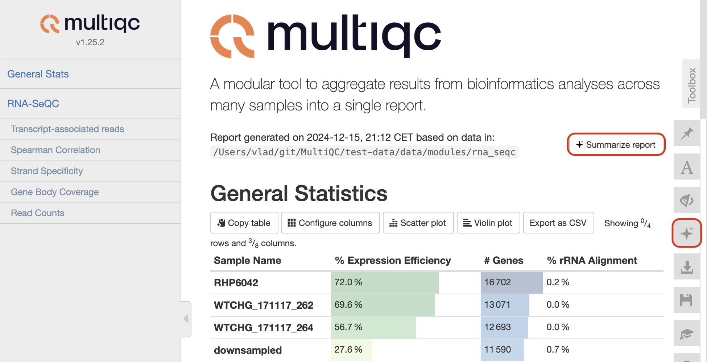
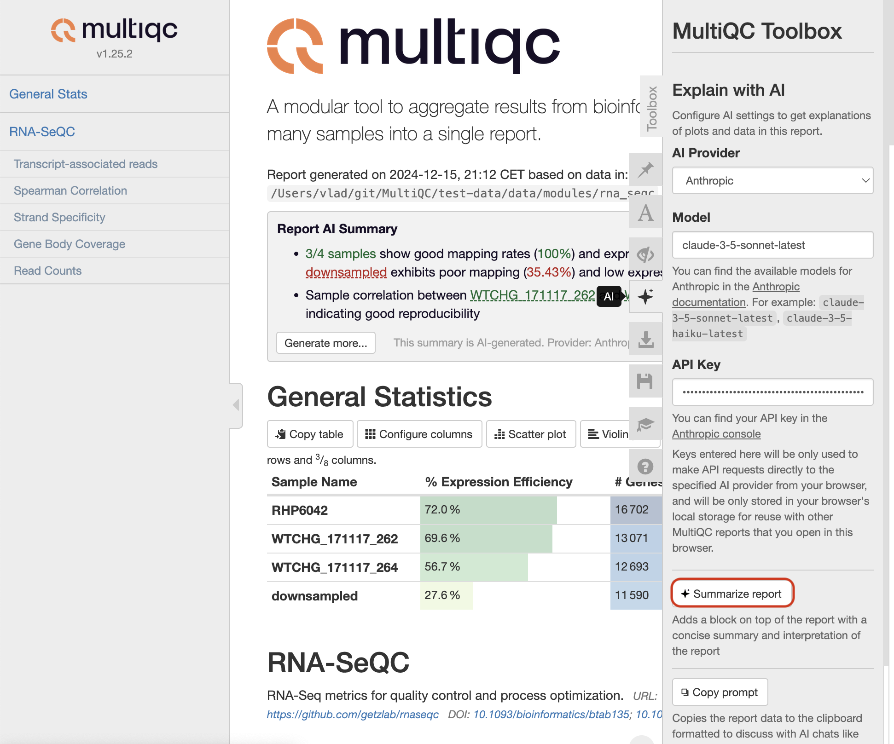
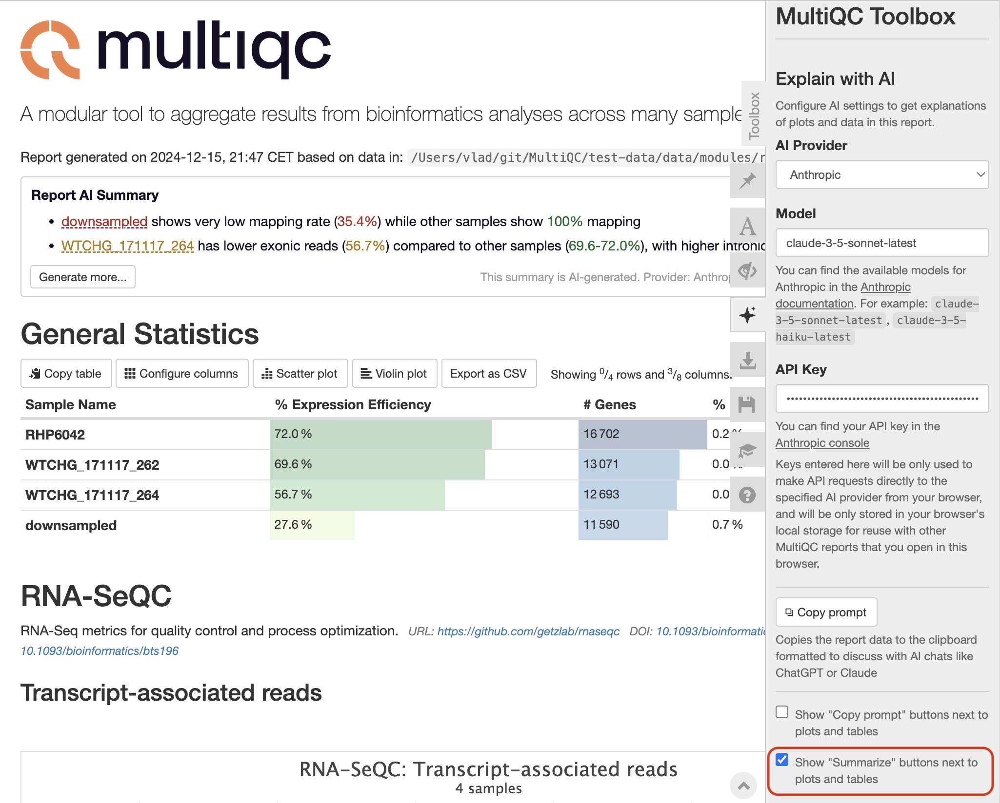
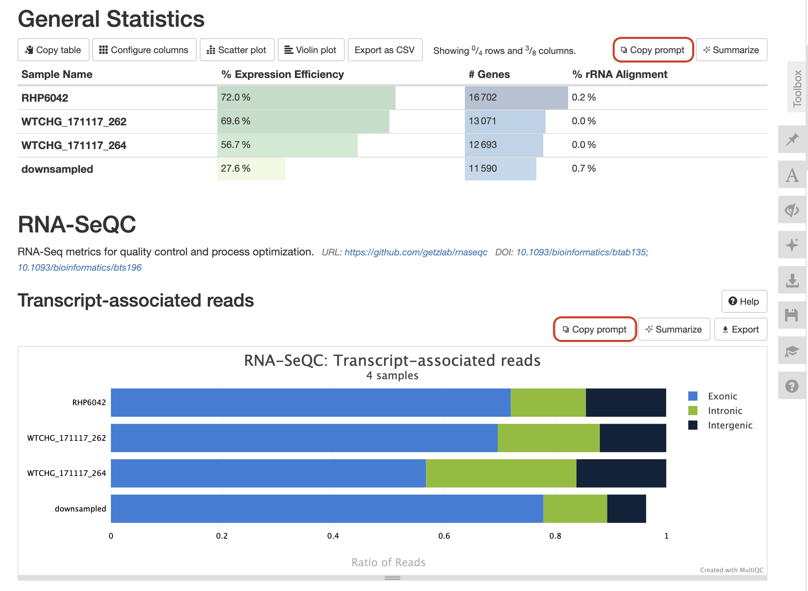
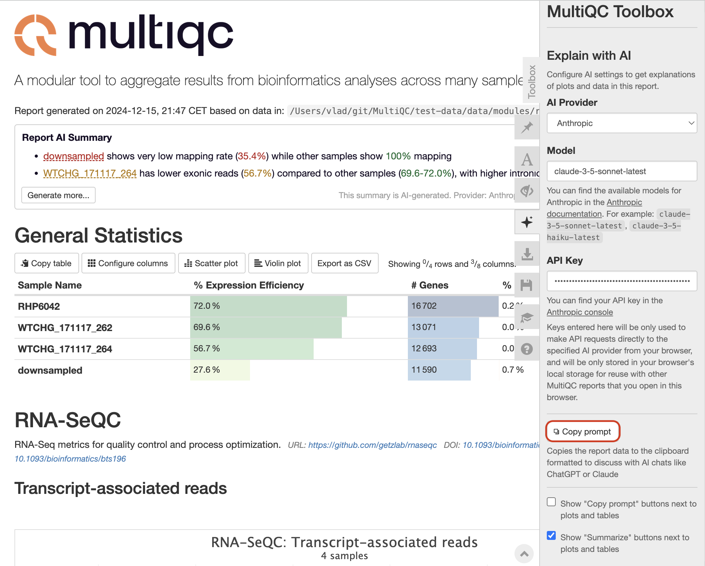

# AI Summaries

You can add AI-powered summaries of your reports. Summaries can be generated both when creating the report, as well as dynamically in browser in an existing HTML report.

## Enabling AI Summaries

1. Command line flags:

- `--ai-summary`: Generate a short report summary and put it on top of the report
- `--ai-summary-full`: Generate a detailed version of the report summary with analysis and recommendations

2. Configuration file:
   ```yaml
   ai_summary: true
   ai_summary_full: true
   ```

You will need to find and set your provider's API key in order to access its service. In command line, the API keys can be passed through the environment variables (or an `.env` file):

```bash
export OPENAI_API_KEY=sk-...
export ANTHROPIC_API_KEY=sk-...
export TOWER_ACCESS_TOKEN=...
```

Note that they will only be used for `--ai-summary`/`--ai-summary-full` generation and discarded afterwards, so they will not be seen by the HTML report for security reasons.

The in-browser summary can be added by clicking the "Summarize report" button in the top right corner of the report, or thought the corresponding toolbox section:





In browser, you can put your API keys in the corresponding field in the "AI" section of the report toolbox. They will be stored only in your browser's local storage, and used to send report data directly to your AI provider of choice.


## Configuring AI Providers

MultiQC supports the following AI providers:

- Anthropic (Claude models; tested to work well with `claude-3-5-sonnet`, but `claude-3-5-haiku` also generates generally good summaries)
- OpenAI (GPT models; tested to work well with `gpt-4o`)
- SeqeraAI (it's hardcoded to use `claude-3-5-sonnet` by default; good option if you have a Seqera Platform account)

You can specify the provider and model name in config file:

```yaml
ai_provider: "anthropic" # or "openai" or "seqera"
ai_model: "claude-3-5-sonnet-latest"
```

In browser, the provider and the model name can be set in the toolbox panel ("AI" section). The configuration will be stored in your browser's local storage, so it will preserved when you reopen report, or open another MultiQC report in the same computer.

## In-browser AI Summaries

Besides a global report-level AI summary, you can generate a summary for each plot or table separately using buttons next to each section:


You can also copy the entire prompt that MultiQC would use to generate a summary. Using the toolbox, you can enable the "Copy prompt" buttons to be shown next to each "Summarize" button:





A button will copy the LLM-friendly formatted report data along with the system prompt into your clipboard, which you can then paste into your an AI chat interace of your provider of choice.

You can also copy the prompt for the entire report by clicking the "Copy prompt" button in the toolbox:



## Context window

Modern LLM to date have a context window size in 128,000-200,000 tokens, which translates to about 100,000-160,000 characters in report data. Meaning that large reports for thousands of samples might not fit in the context window. If the entire report doesn't fit the context window, only the general statistics table will be included in the prompt, as it represents the essential overall information of the report. However, if even the general statistics can't be included, it would not be possible to generate an AI summary. Try hiding samples and/or table columns until the general statistics table fits the context

## Security Considerations

- API keys put in the toolbox are stored only in your browser's local storage
- No report data or keys are sent to any servers except the chosen AI provider
- However, consider security implications when sending reports with sensitive data to your AI provider
