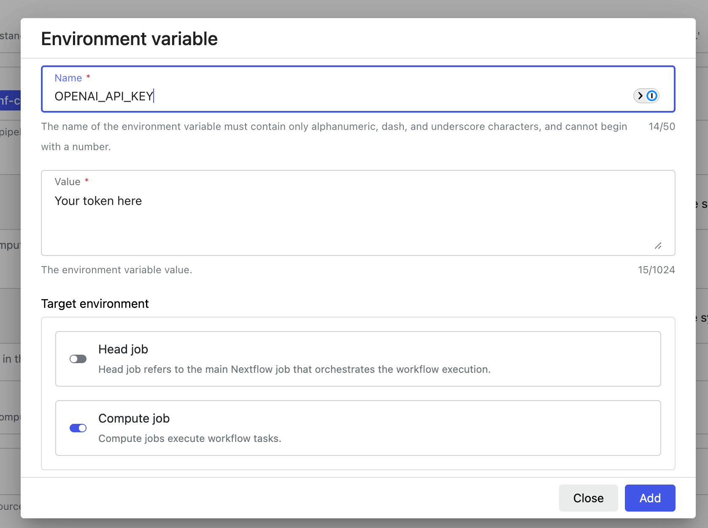

# AI Summaries

MultiQC v1.27 onwards can generate AI-powered summaries of your reports. These can be created at two points:

- When creating the report (baked into the report HTML)
- Dynamically in the browser, whilst viewing an existing HTML report (ephemeral)

The AI summaries are generated using LLMs (large-language models) AI, using
[Seqera AI](https://seqera.io/ask-ai/), [OpenAI](https://openai.com/) or [Anthropic](https://www.anthropic.com/).
MultiQC reports also have an option to copy a prompt to your clipboard, to paste into any provider you have access to.

:::warning

Never rely on AI-generated summaries. Whilst these summaries can be useful to get you started quickly with a report, they may give inaccurate analysis and miss important details.

:::

:::note

AI summaries work by sending report data to an LLM provider of your choice, via an API over the internet.
Be aware of what data you are sending, and to who.
Read more about privacy any Seqera AI [here](https://seqera.io/ai-trust/).

:::

## Choosing a provider

To use native summary generation, MultiQC needs to communicate with an LLM provider's API.
All three supported services require an API key to work.

:::info

Seqera AI is free to use, though there are usage limits.
OpenAI / Anthropic API usage is billed based on consumption.

:::

1. [Seqera AI](https://seqera.io/ask-ai/)
   - Register for free at [seqera.io](https://seqera.io/)
   - Create a new key on the _"User tokens"_ page: [https://cloud.seqera.io/tokens](https://cloud.seqera.io/tokens)
2. [OpenAI](https://openai.com/)
   - Register at [platform.openai.com](https://platform.openai.com/signup) (NB: different to ChatGPT)
   - Add a payment method to your account to enable API usage beyond any trial credits
   - Create a new secret key on the _API Keys_ section [under your profile](https://platform.openai.com/api-keys)
3. [Anthropic](https://www.anthropic.com/)
   - Sign up at [https://console.anthropic.com](https://console.anthropic.com)
   - Add a payment method to enable API access
   - Create a new key on on the _API Keys_ section in your [account settings](https://console.anthropic.com/settings/keys)
4. Any other provider, via your clipboard
   - You can use buttons in MultiQC reports to copy a prompt to your clipboard,
     in order to manually summarise report data.
     See [Copying prompts](#copying-prompts) for instructions.

:::note

Treat your API keys like passwords, and do not share them.

:::

### Choosing a model

If you're using OpenAI or Anthropic you can choose the exact model used for report summaries.
This is done by setting `ai_model` in the MultiQC config.

- Anthropic model names must begin with `claude`
  - Default: `claude-3-5-sonnet-latest`. Tested with Sonnet 3.5 and Haiku 3.5. See the [Anthropic docs](https://docs.anthropic.com/en/docs/intro-to-claude#model-options).
- OpenAI model names must being with `gpt`
  - Default: `gpt-4o`. Tested with GPT-4o and GPT-4o-mini. See the [OpenAI docs](https://platform.openai.com/docs/models).

This model will then be used during report generation and also set as the default toolbox panel setting for browser report summaries.

## Summaries during report generation

MultiQC can generate AI summaries at run time, when generating reports.
Summary text will be included within the report HTML as static text and will be visible to anyone viewing the report,
however it is shared.

AI summaries are disabled by default when running MultiQC.
To generate them, you must enable them either on the command line or via a MultiQC config file.

1. Command line flags:

   - `--ai` / `--ai-summary`: Generate a short report summary and put it on top of the report (fast)
   - `--ai-summary-full`: Generate a detailed version of the summary with analysis and recommendations (slower)
   - `--ai-provider <provider>`: Choose AI provider. `seqera`, `openai` or `anthropic`. Default `seqera`
   - `--no-ai`: Disable AI toolbox and buttons in the report

2. Alternatively, MultiQC configuration file:
   ```yaml
   ai_summary: false # Set to true for short summaries
   ai_summary_full: false # Set to true for  long summaries
   ai_provider: "seqera" # 'seqera', 'openai' or 'anthropic'. Default: 'seqera'
   no_ai: false # Set to true to disable AI toolbox and buttons in the report
   ```

You will need to set your provider's API key in an environment variable in order to access its service
_(see [Choosing a provider](#choosing-a-provider) for how to get an API key)_.
The API keys are supplied by setting the following environment variables:

```bash
export SEQERA_ACCESS_TOKEN="..."  # or TOWER_ACCESS_TOKEN
export OPENAI_API_KEY="..."
export ANTHROPIC_API_KEY="..."
```

If you run MultiQC without the appropriate key you will get a warning printed to the console,
but report generation will otherwise proceed without the summary. MultiQC will not return an error exit code.

:::tip

Any MultiQC config option can also be set using environment variables
(see [Config with environment variables](../getting_started/config.md#config-with-environment-variables)),
so you can set up everything this way:

```bash
export MULTIQC_AI_SUMMARY=1
export SEQERA_ACCESS_TOKEN="..."
```

:::

MultiQC uses the [python-dotenv](https://saurabh-kumar.com/python-dotenv/) package,
so you can also use an `.env` file either in the current working directory or the MultiQC source code directory.

:::note

Environment variables will only be used for `--ai-summary`/`--ai-summary-full` generation.
They are not saved by MultiQC and cannot be used for in-browser summary generation, within reports.

:::

## In-browser AI Summaries

In addition to summaries during report generation, MultiQC can also create summaries dynamically in reports.
This can be useful as the person viewing a report is often different to the person who generated it.
Summaries can be generated on demand, when needed.

The AI toolbox and _Summarize_ buttons are shown by default in all reports. To prevent this, run MultiQC with the `--no-ai` flag.
This can be done on a per-user basis by selecting _Remove AI buttons_ in the _AI Provider_ dropdown in the AI toolbox.

Summaries generated in reports are _ephemeral_ - that is, they are not saved in the HTML.
If you generate a summary and share the report then others will not see it.
MultiQC tries to save the summary response within your browser's [local storage](https://www.w3schools.com/html/html5_webstorage.asp)
so that it shows the next time you open the same report, but this process is imperfect and may not always work.

### Configuring the AI provider

<div style={{float:"right"}}>


</div>

When you first try to generate a summary in the browser, you must supply the LLM provider's API key.
Open the AI settings by clicking the icon in the toolbox:

Then, choose an AI provider and enter the relevant API key
_(see [Choosing a provider](#choosing-a-provider) for how to get an API key)_.

:::info

API keys will be stored only in your browser's local storage, so will not be shared with anyone if you send the HTML report to someone else.
They are used to send report data directly to your AI provider of choice.

:::


### Summarising the report

Once your provider API key is configured, click _"Summarize report"_ to generate an overview summary of the entire report.

:::info

The summary text is interactive! Click an underlined sample name to highlight that sample throughout the report.

:::


### Section-level summaries

Besides a global report-level AI summary, you can generate a summary for each plot or table separately using buttons next to each section:


You can also copy the entire prompt that MultiQC would use to generate a summary. Using the toolbox, you can enable the "Copy prompt" buttons to be shown next to each "Summarize" button:


A button will copy the LLM-friendly formatted report data along with the system prompt into your clipboard, which you can then paste into your an AI chat interace of your provider of choice.

### Copying prompts

If you have access to an LLM that is not directly supported by MultiQC, you can copy the exact prompt
that MultiQC uses to your clipboard. This can be pasted into whatever you have access to.

To do this, click the "Copy prompt" button in the toolbox:


## Context window

A context window refers to the amount of text (in tokens) that an AI model can consider at once
when processing input and generating responses, encompassing both the input prompt and the output.
At the time of writing, modern LLMs typically have a context window size in 128k - 200k tokens,
which translates to about 100k - 160k characters of report data.
That means that very large reports - of thousands of samples - might not fit in the available LLM context window.

MultiQC uses the following logic, moving on to the next step if the prompt is still too large:

1. Attempt to include all report data in the prompt.
2. Include just the general statistics table.
3. Include the general statistics table, without hidden-by-default columns.
4. Abort AI summary.

If you're struggling to generate an AI summary, you can try the following:

- Hide additional columns in the general statistics table (see [Hiding Columns](../reports/customisation.md#hiding-columns)).
- Hide General statistics data in the browser, and request the AI summary dynamically:
  - Hide columns with the "Configure columns" button
  - Filter shown samples dynamically with the toolbox
- Copy the prompt from `multiqc_data/multiqc_ai_prompt.txt` or into clipboard with the "Copy prompt" button in the toolbox, and use it with extrenal services with a larger context window.

## Configuring within Nextflow

If you're running MultiQC within a Nextflow pipeline, you probably don't want to edit the workflow code to configure AI summaries.
Most nf-core pipelines with MultiQC have a `--multiqc_config` option to provide additional YAML config for MultiQC.
However, because API keys must be passed using environment variables anyway, the recommended method is to use
environment vars for everything.

Using this approach means that no pipeline code needs adjustment, only a small addition to the Nextflow config
by using the [`env` config scope](https://nextflow.io/docs/latest/reference/config.html#env).

For example, to use with OpenAI you would set the following in your Nextflow config:

```groovy
env {
   MULTIQC_AI_SUMMARY_FULL = 1              // Enable long summaries during report generation
   MULTIQC_AI_PROVIDER = "openai"           // Select OpenAI as provider
   OPENAI_API_KEY = secrets.OPENAI_API_KEY  // Access key for OpenAI
}
```

The relevant environment variables are [described above](#summaries-during-report-generation).

:::note

The above example uses [Nextflow Secrets](https://nextflow.io/docs/latest/secrets.html)
to securely manage your API keys outside of your config file.
To add this Nextflow secret you would run the following command in the terminal:

```bash
$ nextflow secrets set OPENAI_API_KEY "xxxx"
```

:::

:::tip

Add this config to `~/.nextflow/config` and it will be applied to every Nextflow pipeline you launch.

:::

### Using Seqera Platform

If using Seqera Platform the above config can be used when launching pipelines or adding them to the launchpad.
However, environment variables can also be added at _Compute Environment_ level and will then affect every pipeline
run using that CE, without further modification.
This effectively means that provider API keys can be managed at workspace level.

To do this, toggle the _"Environment variables"_ section when creating a Compute Environment and click _"Add variable"_.

Make sure that the _"Target environment"_ has _"Compute job"_ toggled on.



Once added:


## Security Considerations

MultiQC AI summaries are used at your own risk.
Treat results with appropriate mistrust and consider what data you are sending to external services.

- API keys set in environment variables are not saved in report outputs
- API keys put in the toolbox are stored only in your browser's local storage
- No report data or keys are sent to any servers except the chosen AI provider

Seqera AI does not use inputs for subsequent fine-tuning or direct model improvement.
You can find our more information about Seqera's pledge for privacy at
[https://seqera.io/ai-trust/](https://seqera.io/ai-trust/)
