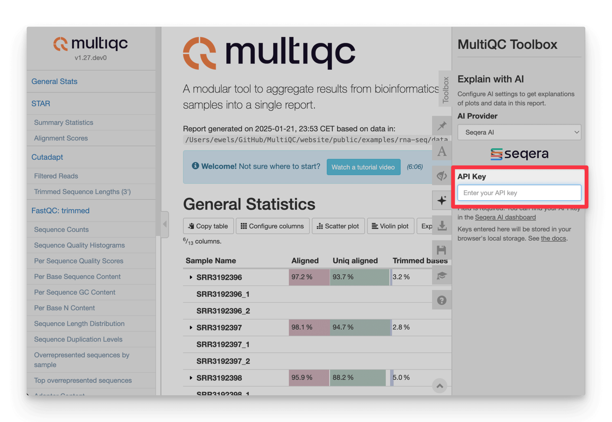

# AI summaries

MultiQC v1.27 and newer can generate AI-powered summaries of your reports. These can be created at two points:

- When creating the report, baked into the report HTML.
- Dynamically in the browser, while viewing an existing HTML report.

The AI summaries are generated using LLMs (large-language models) AI, with the following supported providers:

- [Seqera AI](https://seqera.io/ask-ai/)
- [OpenAI](https://openai.com/)
- [Anthropic](https://www.anthropic.com/)
- [AWS Bedrock](https://aws.amazon.com/bedrock/)
- MultiQC reports also have an option to copy a prompt to your clipboard, to paste into any provider you have access to

:::warning

Never rely on AI-generated summaries. Whilst these summaries can be useful to get you started quickly with a report, they may give inaccurate analysis and miss important details.

:::

AI summaries work by sending report data to an LLM provider of your choice, via an API over the internet.
Be aware of what data you are sending, and to who.
For more information, see [Seqera AI: Your privacy matters](https://seqera.io/ai-trust/).

## Choosing a provider

To use native summary generation, MultiQC needs to communicate with an LLM provider's API.
All three supported services require an API key to work.
Remember: Treat your API keys like passwords and do not share them.

- [Seqera AI](https://seqera.io/ask-ai/)
  - Register for free at [seqera.io](https://seqera.io/)
  - Create a new key on the **Access tokens** page: [https://cloud.seqera.io/tokens](https://cloud.seqera.io/tokens)
- [OpenAI](https://openai.com/)
  - Register at [platform.openai.com](https://platform.openai.com/signup) (NB: different to ChatGPT)
  - Add a payment method to your account to enable API usage beyond any trial credits
  - Create a new secret key on the _API Keys_ section [under your profile](https://platform.openai.com/api-keys)
- [Anthropic](https://www.anthropic.com/)
  - Sign up at [https://console.anthropic.com](https://console.anthropic.com)
  - Add a payment method to enable API access
  - Create a new key on on the _API Keys_ section in your [account settings](https://console.anthropic.com/settings/keys)
- [AWS Bedrock](https://aws.amazon.com/bedrock/)
  - Bedrock supports a plethora of models across many providers
  - Sign up, access credentials and payment are handled via an AWS account
- Other providers, via custom endpoint
  - Works for providers supporting OpenAI-compatible API, specify a custom endpoint URL. See [Using custom OpenAI-compatible endpoints](#using-custom-openai-compatible-endpoints) for details
- Other providers, via your clipboard
  - You can use buttons in MultiQC reports to copy a prompt to your clipboard,
    in order to manually summarise report data.
    See [Copying prompts](#copying-prompts) for instructions.

Seqera AI is free to use.[^seqera-ai-usage-limits]
Use of other third-party APIs are billed by their respective providers based on consumption.
Seqera AI uses the latest AI provider models under the hood.

### Choosing a model

If you're using OpenAI, Anthropic or AWS Bedrock you can choose the exact model used for report summaries.
This is done by setting `ai_model` in the MultiQC config.

- Anthropic model names must begin with `claude`
  - Default: `claude-sonnet-4-5`.
  - See the [Anthropic docs](https://docs.anthropic.com/en/docs/intro-to-claude#model-options).
- OpenAI model names must being with `gpt`
  - Default: `gpt-4o`.
  - See the [OpenAI docs](https://platform.openai.com/docs/models).
- Bedrock model names must be valid inputs to the `modelId` parameter of the `InvokeModel` API ([docs](https://docs.aws.amazon.com/bedrock/latest/APIReference/API_runtime_InvokeModel.html#API_runtime_InvokeModel_RequestSyntax)).

This model is used during report generation and also set as the default toolbox panel setting for browser report summaries.

## Reasoning Models

MultiQC supports reasoning models from multiple providers which provide enhanced reasoning capabilities for complex bioinformatics analysis interpretation. These models "think" before responding, using internal reasoning to provide more accurate and thorough analysis.

### Supported Reasoning Models

- OpenAI: `o1`, `o3`, `o3-mini`, `o4-mini`
- Anthropic Claude 4 series: `claude-sonnet-4-5`

### Configuration

Simply set your AI model to a reasoning model:

```yaml
# multiqc_config.yaml
ai_summary: true
ai_provider: openai # or Anthropic for Claude 4
ai_model: o3-mini # or claude-sonnet-4-5, o4-mini, etc.
```

Reasoning models support additional configuration parameters:

**OpenAI reasoning models:**

```yaml
# multiqc_config.yaml
ai_summary: true
ai_provider: openai
ai_model: o3-mini
ai_reasoning_effort: high # low, medium, or high
ai_max_completion_tokens: 8000 # adjust based on needs
```

**Anthropic Claude 4 extended thinking:**

```yaml
# multiqc_config.yaml
ai_summary: true
ai_provider: anthropic
ai_model: claude-sonnet-4-5
ai_extended_thinking: true # enable extended thinking
ai_thinking_budget_tokens: 15000 # budget for extended thinking
```

### Configuration Options

**OpenAI reasoning models:**

- **`ai_reasoning_effort`**: Controls how much time the model spends reasoning
  - `low`: Faster responses, less thorough reasoning
  - `medium`: Balanced speed and reasoning depth (default)
  - `high`: Slower but most thorough reasoning
- **`ai_max_completion_tokens`**: Maximum tokens for model output (default: 4000)
  - Higher values allow longer, more detailed summaries

**Anthropic extended thinking:**

- **`ai_extended_thinking`**: Enable extended thinking for Claude 4 models (default: false)
  - Must be set to `true` to enable extended thinking capabilities
  - When disabled, Claude 4 models run as regular models without extended thinking
- **`ai_thinking_budget_tokens`**: Maximum tokens for internal reasoning process (default: 10000)
  - Only applies when `ai_extended_thinking` is enabled
  - Controls how much "thinking" the model can do before responding
  - Higher budgets enable more thorough analysis for complex problems
  - The model may not use the entire budget allocated

### Key Differences from Regular Models

1. **Internal Reasoning**: Reasoning models "think" before responding, using hidden reasoning tokens
2. **Enhanced Accuracy**: Better performance on complex analytical tasks
3. **Different Parameters**: Use `max_completion_tokens` and `reasoning_effort`
4. **Developer Messages**: Use developer messages instead of system messages for better performance

### Usage Examples

**Basic Configuration for o1-mini:**

```yaml
ai_summary: true
ai_provider: openai
ai_model: o1-mini
```

**High-Quality Analysis with o3:**

```yaml
ai_summary: true
ai_summary_full: true
ai_provider: openai
ai_model: o3
ai_reasoning_effort: high
ai_max_completion_tokens: 6000
```

**Cost-Optimized Setup with o4-mini:**

```yaml
ai_summary: true
ai_provider: openai
ai_model: o4-mini
ai_reasoning_effort: low
ai_max_completion_tokens: 3000
```

**Anthropic Claude 4 Extended Thinking:**

```yaml
ai_summary: true
ai_provider: anthropic
ai_model: claude-sonnet-4-5
ai_extended_thinking: true # enable extended thinking
ai_thinking_budget_tokens: 12000 # budget for thinking process
```

### Model Recommendations

- **`o4-mini`**: Most cost-effective, good for routine analysis
- **`o3-mini`**: Balanced performance and cost
- **`o3`**: Best reasoning capabilities for complex reports
- **`o1-mini`**: Good for coding-heavy bioinformatics analysis

### Notes

- **Performance**: Both OpenAI reasoning models and Anthropic extended thinking may take longer to respond due to internal reasoning
- **Billing**: Reasoning/thinking tokens are charged but internal reasoning is not visible in the output
- **Context windows**: o1 series (128k), o3/o4 series (200k), Claude 4 series (200k+)
- **OpenAI reasoning models**: Don't support parameters like `temperature`, use `reasoning_effort` and `max_completion_tokens`
- **Anthropic extended thinking**: Uses standard Anthropic API with `thinking.budget_tokens` parameter, supports regular parameters like `temperature`
- **Different approaches**: OpenAI uses specialized reasoning models, while Anthropic adds extended thinking capabilities to their regular models

## Summaries during report generation

MultiQC can generate AI summaries at run time, when generating reports.
Summary text is included within the report HTML as static text and will be visible to anyone viewing the report,
even when shared.

### MultiQC configuration

AI summaries are disabled by default when running MultiQC.
To generate them, you must enable them either on the command line or via a MultiQC config file.

- Command line flags:
  - `--ai` / `--ai-summary`: Generate a short report summary and put it on top of the report (fast)
  - `--ai-summary-full`: Generate a detailed version of the summary with analysis and recommendations (slower)
  - `--ai-provider <provider>`: Choose AI provider. One of `seqera`, `openai`, `anthropic` or `aws_bedrock`. Default `seqera`
  - `--no-ai`: Disable AI toolbox and buttons in the report

- Alternatively, MultiQC configuration file:
  ```yaml
  ai_summary: false # Set to true for short summaries
  ai_summary_full: false # Set to true for  long summaries
  ai_provider: "seqera" # 'seqera', 'openai', 'anthropic' or 'aws_bedrock'. Default: 'seqera'
  no_ai: false # Set to true to disable AI toolbox and buttons in the report
  ```

### Environment variables

You must also set your provider's API key in an environment variable in order to access its service
_(see [Choosing a provider](#choosing-a-provider) for how to get an API key)_.
API keys are supplied by setting the following environment variables in your shell:

```bash
export SEQERA_ACCESS_TOKEN="..."  # or TOWER_ACCESS_TOKEN
export OPENAI_API_KEY="..."
export ANTHROPIC_API_KEY="..."
```

It's possible to save these in an `.env` file instead of exporting to your shell's environment.
This `.env` file can either be in the current working directory or the MultiQC source code directory.
MultiQC uses the [python-dotenv](https://saurabh-kumar.com/python-dotenv/) package.

For AWS Bedrock, the client uses the [default `boto3` credential chain](https://boto3.amazonaws.com/v1/documentation/api/latest/guide/credentials.html).

If you run MultiQC without the appropriate key you will get a warning printed to the console,
but report generation will otherwise proceed without the summary. MultiQC will not return an error exit code.

:::tip

MultiQC configuration options can also be set using environment variables
(see [Config with environment variables](../getting_started/config.md#config-with-environment-variables)),
so you can set up everything, including the command line flags / config this way:

```bash
export MULTIQC_AI_SUMMARY=1
export SEQERA_ACCESS_TOKEN="..."
```

:::

Environment variables will only be used for `--ai-summary`/`--ai-summary-full` generation.
They are not saved by MultiQC and cannot be used for in-browser summary generation, within reports.

## In-browser AI summaries

In addition to summaries during report generation, MultiQC can also create summaries dynamically in reports.
This can be useful as the person viewing a report is often different than the person who generated it.
Summaries can be generated on demand when needed.

The AI toolbox and **Summarize** buttons are shown by default in all reports. To prevent this, run MultiQC with the `--no-ai` flag.
This can also be done on a per-user basis by selecting **Remove AI buttons** in the **AI Provider** dropdown in the AI toolbox.

Summaries generated in reports are _ephemeral_ and are not saved in the HTML.
If you generate a summary and share the report then others will not see it.
MultiQC tries to save the summary response within your browser's [local storage](https://www.w3schools.com/html/html5_webstorage.asp)
so that it shows the next time you open the same report, but this process is imperfect and might not always work.

### Configuring the AI provider

<div style={{float:"right", width:200}}>


</div>

When you first try to generate a summary in the browser, you must supply the LLM provider's API key.
Open the AI settings by clicking the icon in the toolbox:

Then, choose an AI provider and enter the relevant API key
_(see [Choosing a provider](#choosing-a-provider) for how to get an API key)_.

:::info[Important]

API keys are stored _only_ in your browser's [local storage](https://www.w3schools.com/html/html5_webstorage.asp)
and are not shared if you send the HTML report to someone else.
They are used to send report data directly to your AI provider of choice.

:::



### Summarising the report

Once your provider API key is configured, click **Summarize report** to generate an overview summary of the entire report.


The summary text is interactive: click an <u>underlined</u> sample name to highlight that sample throughout the report:


### Section-level summaries

Besides a global report-level AI summary, you can generate a summary for each plot or table separately using buttons next to each section:


### Copying prompts

If you have access to an LLM that is not directly supported by MultiQC, you can copy the exact prompt
that MultiQC uses to your clipboard. This can be pasted into whatever LLM that you have access to.

To do this, select **Copy prompts** as the LLM provider in the report toolbox AI tab.
The **Summarize** buttons will then change to **Copy prompt** buttons and instead of injecting
summaries into the report HTML, will copy the LLM prompt to your clipboard.

### Remove AI buttons

If you're suffering from AI-overload and don't want to see the AI summary features in your reports,
you can disable them by selecting **Remove AI buttons** in the toolbox as an AI provider.
This will remove all **Summarize** buttons from the report.

This is done at user level and will be stored in the browser's local storage and applied to all
MultiQC reports that you open.
You can also use `--no-ai` when generating reports, which removes this functionality from the HTML for all users.

## Using `llms-full.txt`

MultiQC always saves the full prompt and response to `multiqc_data/llms-full.txt` file,
regardless of whether the summary was generated during report generation or in the browser.

This file can be used to debug or further analyse the AI summary generation process.
It can be used to directly copy the prompt into your clipboard and use it with external services, e.g. ones with a larger context window.

## Continue chat

If using Seqera AI as a provider, you can click the **Chat with Seqera AI** button to open the Seqera AI
chat interface in a new tab in order to ask further questions.
This button is shown alongside the report-level summary after it's generated.


If you are logged in to [seqera.io](https://seqera.io) with the same user that generated the report summary,
the chat history with the report prompt and AI summary response will be loaded allowing you to
continue straight on with more in-depth questions.


## Context window

A context window refers to the amount of text (in tokens) that an AI model can consider at once
when processing input and generating responses, encompassing both the input prompt and the output.
At the time of writing, modern LLMs typically have a context window size in 128-200k tokens,
which translates to about 100-160k characters of report data.
That means that very large reports, of thousands of samples, might not fit in the available LLM context window.

MultiQC uses the following logic, moving on to the next step if the prompt is still too large:

1. Attempt to include all report data in the prompt.
2. Include just the general statistics table.
3. Include the general statistics table, without hidden-by-default columns.
4. Abort AI summary.

If you're unable to generate an AI summary, you can try the following:

- Hide additional columns in the general statistics table (see [Hiding Columns](../reports/customisation.md#hiding-columns)).
- Hide General statistics data in the browser, and request the AI summary dynamically:
  - Hide columns with the **Configure columns** button
  - Filter shown samples dynamically with the toolbox
- Copy the prompt from `multiqc_data/llms-full.txt` into clipboard with the **Copy prompt** button in the toolbox, and use it with external services with a larger context window.

## Using custom OpenAI-compatible endpoints

In addition to the built-in providers, MultiQC supports using custom OpenAI-compatible endpoints. This allows you to use self-hosted models or alternative providers that implement the OpenAI API specification.

To use a custom endpoint:

1. Select "Custom" as the AI provider in the toolbox
2. Enter the endpoint URL (e.g., `http://localhost:8000/v1/chat/completions`)
3. Specify the model name to use with this endpoint
4. Provide an API key (if required by the endpoint)
5. Optionally specify a custom context window size if different from the default 128k tokens

You can configure this in the MultiQC config:

```yaml
ai_provider: custom
ai_model: your-model-name
ai_custom_endpoint: http://localhost:8000/v1/chat/completions
ai_custom_context_window: 32000 # Optional
```

Make sure to set the `OPENAI_API_KEY` environment variable to use with the custom endpoint:

```bash
export OPENAI_API_KEY=your-api-key
```

You can also customize the query payload sent to the endpoint by setting `ai_extra_query_options` in your config:

```yaml
ai_extra_query_options:
  temperature: 0.7
  top_p: 0.9
  # Any other parameters supported by your endpoint
```

In browser, you can also select "Custom" provider from the toolbox, and enter the endpoint URL, model name, API key, and optional extra query options manually.

## Configuring within Nextflow

If you're running MultiQC within a Nextflow pipeline, you probably don't want to edit the workflow code to configure AI summaries.
Most nf-core pipelines with MultiQC have a `--multiqc_config` option to provide an additional YAML config for MultiQC.
However, because API keys must be passed using environment variables, the recommended method is to use
environment vars for everything.

Using this approach means that no pipeline code needs adjustment, only a small addition to the Nextflow config.
For example, to use with OpenAI you would set the following in your Nextflow config:

```groovy
env {
  MULTIQC_AI_SUMMARY_FULL = 1     // Enable long summaries during report generation
  MULTIQC_AI_PROVIDER = "openai"  // Select OpenAI as provider
}
process.withName: MULTIQC {
  secret = [ 'OPEN_API_KEY' ]     // Access key for OpenAI
}
```

In this example, [Nextflow Secrets](https://nextflow.io/docs/latest/secrets.html) are used
to securely manage your API keys outside of your config file.
To add this Nextflow secret you would run the following command in the terminal:

```bash
$ nextflow secrets set OPENAI_API_KEY "xxxx"
```

Note that secrets can behave differently across different compute environment types.
See the [Nextflow docs](https://www.nextflow.io/docs/latest/secrets.html#process-directive)
for details.

:::tip

Save this Nextflow config to `~/.nextflow/config` and it
[will be applied](https://nextflow.io/docs/edge/config.html#configuration-file)
to every Nextflow pipeline you launch.

:::

## Security considerations

MultiQC AI summaries are used at your own risk.
Treat results with appropriate mistrust and consider what data you are sending to external services.

- API keys set in environment variables are not saved in report outputs
- API keys put in the toolbox are stored only in your browser's local storage
- No report data or keys are sent to any servers except the chosen AI provider

Seqera AI does not use inputs for subsequent fine-tuning or direct model improvement.
You can find our more information about Seqera's pledge for privacy at
[https://seqera.io/ai-trust/](https://seqera.io/ai-trust/)

### Sample anonymization

MultiQC provides an option to anonymize sample names when generating AI summaries, both during report generation and in the browser. This helps protect sensitive information when sharing summaries with AI providers.

To enable sample anonymization:

- For in-browser summaries: Toggle "Anonymize samples" in the AI toolbox section
- For report generation: Set `anonymize_samples: true` in your MultiQC config

When enabled, sample names are replaced with generic pseudonyms (e.g., "SAMPLE_1", "SAMPLE_2") before being sent to the AI provider. The anonymization is applied consistently across the entire report - each sample name gets the same pseudonym wherever it appears. When the AI response references samples, the pseudonyms are automatically converted back to the original sample names before displaying.

MultiQC replaces sample names that appear as typical keys in plots and tables, specifically:

- First column of a table table (e.g. the General statistics table)
- Labels of bars in bar plots
- Line names in line plots
- Data point labels in scatter plots
- Heatmap axis labels
- Violin plot data point names

But note that if a module creates some custom plot configuration where sample names are used elsewhere, anonymization would not be guaranteed.

:::info

Note that with the "Continue chat" button you would see the anonymized samples, which makes it less useful.

:::

[^seqera-ai-usage-limits]:
    Seqera Cloud Basic is free for small teams.
    It includes access to Seqera AI, with a usage cap of 100 messages per calendar month.
    Seqera AI usage is unlimited for Seqera Cloud Pro users.
    Researchers at qualifying academic institutions can apply for free access to Seqera Cloud Pro.
    See [Seqera Pricing](https://seqera.io/pricing/) for more details
