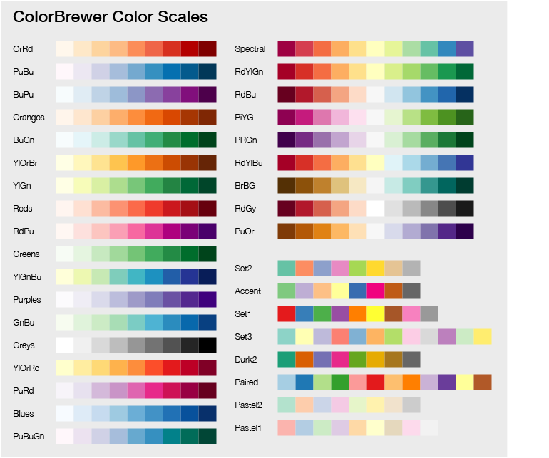

# Writing New Modules

## Introduction

Writing a new module can at first seem a daunting task. However, MultiQC
has been written _(and refactored)_ to provide a lot of functionality
as common functions.

Provided that you are familiar with writing Python and you have a read
through the guide below, you should be on your way in no time!

If you have any problems, feel free to contact the author - details
here: [@ewels](https://github.com/ewels)

## Core modules / plugins

New modules can either be written as part of MultiQC or in a stand-alone
plugin. If your module is for a publicly available tool, please add it
to the main program and contribute your code back when complete via a
pull request.

If your module is for something _very_ niche, which no-one else can use,
you can write it as part of a custom plugin. The process is almost identical,
though it keeps the code bases separate. For more information about this,
see the docs about _MultiQC Plugins_ below.

## MultiQC Lint Tests

MultiQC has been developed to be as forgiving as possible and will handle lots of
invalid or ignored code. This is useful most of the time but can be difficult when
writing new MultiQC modules (especially during pull-request reviews).

To help with this, you can run with the `--lint` flag, which will give explicit
warnings about anything that is not optimally configured. For example:

```bash
multiqc --lint test_data
```

Note that the automated MultiQC continuous integration testing runs in this mode,
so you will need to pass all lint tests for those checks to pass. This is required
for any pull-requests.

## Code formatting

In addition to testing MultiQC functionality, the MultiQC code base is also checked for
consistency and formatting.

Everyone has their own preferences when it comes to writing any code, both in the methods
used but also with simple things like whitespace and whether to use `"` or `'`.
When reviewing code contributions in pull-requests, these variations in coding style
introduce an additional mental overhead. Inconsistent code style across the package
also makes it harder for newcomers to get into the code.

Code formatting / linting tools are able to assess files in many different languages
and check that a set of "soft" formatting rules are adhered to, to enforce code consistency.
Better still, many of these tools can automatically change the formatting so that developers
can write code in whatever style they prefer and defer this task to automation.

Much like source control, gloves in a lab, and wearing a seatbelt, code formatters and code linting
is an annoying inconvience at first for most people which in time becomes an indespesible
tool in the maintenance of high quality software.

When it comes to MultiQC, three tools are used to set and check the code base:

- [Black](https://github.com/psf/black) - Python Code
- [Prettier](https://prettier.io/) - Everything else (almost)
- [markdownlint-cli](https://github.com/igorshubovych/markdownlint-cli) - Stricter markdown rules

**All developers must run these tools when submitting changes via Pull-Requests!**
Automated continuous integration tests will run using GitHub Actions to check that all files pass the above tests.
If any files do not, that test will fail giving a red :x: next to the pull request.

> Make sure that your configuration is working properly and that you're not changing loads of files
> that you haven't worked with. Pull-requests will not be merged with such changes.

All three tools should be relatively easy to install and run, and have integration with the majority
of code editors. Once set up, they can run on save and you'll never need to think about them again.

For example, [Visual Studio Code](https://code.visualstudio.com/) has
[built-in support for Black](https://code.visualstudio.com/docs/python/editing#_formatting) and
plugins for [Prettier](https://github.com/prettier/prettier-vscode) and
[Markdownlint](https://github.com/DavidAnson/vscode-markdownlint).

Atom also has plugins for [Black](https://atom.io/packages/python-black),
[Prettier](https://atom.io/packages/prettier-atom) and
[Markdownlint](https://atom.io/packages/linter-node-markdownlint).

### Use version control

These tools are set up to edit source code in place. If you're not used to working with them,
make sure that you have saved your changes _and made a commit_ with those changes before running them!
Then if all goes wrong and they make loads of unexpected changes, you can run `git checkout .` to
reset everything before trying again.

### Black

MultiQC is written in Python and so the majority of the codebase is Python.
[Black](https://github.com/psf/black) describes itself as _"The uncompromising code formatter"_
and has very few configuration options on purpose.

Black is very easy to install and run:

```bash
pip install black
black .
```

Black should automatically find the config file in the root of the directory called
`pyproject.toml` which configures it to use a line length of 120 characters.
This should be found automatically.

### Prettier

In addition to Python, MultiQC also has a lot of markdown documentation,
YAML configuration files, custom JavaScript and more. To format these files
we use a tool called [Prettier](https://prettier.io/).

Prettier is available via the Node Package Manager (npm). If you've not used this before,
you'll need to install Node first: <https://nodejs.org/en/download/>

Once `npm` is working, you can [install Prettier](https://prettier.io/docs/en/install.html) globally.
Then run with the `--write` flag to edit files in place.

```bash
npm install -g prettier
prettier --write .
```

Prettier has two config files in the repository root: `.prettierrc.yaml` and `.prettierignore`.
These should be found automatically by Prettier.
One configures Prettier to use longer line lengths of 120 characters and the other tells it to skip
bundled source files and all HTML files (personally I'm not a fan of what it does with HTML).

### Markdownlint

Prettier formats markdown using [remark](https://github.com/remarkjs/remark), which works great.
However, [Markdownlint](https://github.com/DavidAnson/markdownlint) has a lot more strict rules
and checks for a load of additional nice things (eg. specifying code type for syntax highlighting of code blocks).

Markdownlint doesn't fix things in place like the two tools above, instead it just checks files
and reports problems that must be fixed manually.

MultiQC uses [markdownlint-cli](https://github.com/igorshubovych/markdownlint-cli) to run tests.
Once `npm` is working (see above), it's a simple install and run:

```bash
npm install -g markdownlint-cli
markdownlint .
```

There is a config file for markdownlint in the root of the repository called `.markdownlint.yaml`
which disables and tweaks quite a lot of rules. This should be found automatically.

Note that the editor plugins above run this as you edit files, giving little wiggly lines
to warn you about problems as you type.

## Initial setup

### MultiQC file structure

The source code for MultiQC is separated into different folders.
Most of the files you won't have to touch - the relevant files that
you will need to edit or create are as follows:

```console
├── docs
│   ├── README.md
│   └── modules
│       └── <your_module>.md
├── multiqc
│   ├── modules
│   |   └── <your_module>
│   │       ├── __init__.py
│   │       └── <your_module>.py
│   └── utils
│       └── search_patterns.yaml
├── CHANGELOG.md
└── setup.py
```

These files are described in more detail below.

### Submodule

MultiQC modules are Python submodules - as such, they need their own
directory in `/multiqc/` with an `__init__.py` file. The directory should
share its name with the module. To follow common practice, the module
code itself usually then goes in a separate python file (also with the same
name, i.e. `multiqc/modname/modname.py`) which is then imported by the
`__init__.py` file with:

```python
from __future__ import absolute_import
from .modname import MultiqcModule
```

### Entry points

Once your submodule files are in place, you need to tell MultiQC that they
are available as an analysis module. This is done within `setup.py` using
[entry points](http://setuptools.readthedocs.io/en/latest/setuptools.html#dynamic-discovery-of-services-and-plugins).
In `setup.py` you will see some code that looks like this:

```python
entry_points = {
    'multiqc.modules.v1': [
        'bismark = multiqc.modules.bismark:MultiqcModule',
        [...]
    ]
}
```

Copy one of the existing module lines and change it to use your module name.
The order is irrelevant, so stick to alphabetical if in doubt.
Once this is done, you will need to update your installation of MultiQC:

```bash
pip install -e .
```

### MultiQC config

So that MultiQC knows what order modules should be run in, you need to add
your module to the core config file.

In `multiqc/utils/config_defaults.yaml` you should see a list variable called `module_order`.
This contains the name of modules in order of precedence. Add your module here
in an appropriate position.

### Documentation

Next up, you need to create a documentation file for your module. The reason
for this is twofold: firstly, docs are important to help people to use, debug
and extend MultiQC (you're reading this, aren't you?). Secondly,
having the file there with the appropriate YAML front matter will make the
module show up on the [MultiQC homepage](http://multiqc.info) so that everyone
knows it exists. This process is automated once the file is added to the core
repository.

This docs file should be placed in `docs/modules/<your_module_name>.md` and
should have the following structure:

```markdown
---
Name: Tool Name
URL: http://www.amazing-bfx-tool.com
Description: >
  This amazing tool does some really cool stuff. You can describe it
  here and split onto multiple lines if you want. Not too long though!
---

Your documentation goes here. Feel free to use markdown and write whatever
you think would be helpful. Please avoid using heading levels 1 to 3.
```

Make a reference to this in the YAML _frontmatter_ list at the top of
`docs/README.md` - this allows the website to find the file to build
the documentation.

### Changelog

Last but not least, remember to add your new module to the `CHANGELOG.md`,
so that people know that it's there.

### MultiqcModule Class

If you've copied one of the other entry point statements, it will have ended
in `:MultiqcModule` - this tells MultiQC to try to execute a class or function
called `MultiqcModule`.

To use the helper functions bundled with MultiQC, you should extend this
class from `multiqc.modules.base_module.BaseMultiqcModule` in your
module code file (i.e. `multiqc/modname/modname.py`). This will give
you access to a number of functions on the `self` namespace. For example:

```python
from multiqc.modules.base_module import BaseMultiqcModule

class MultiqcModule(BaseMultiqcModule):
    def __init__(self):
        # Initialise the parent object
        super(MultiqcModule, self).__init__(name='My Module', anchor='mymod',
        href="http://www.awesome_bioinfo.com/my_module",
        info="is an example analysis module used for writing documentation.")
```

Ok, that should be it! The `__init__()` function will now be executed every
time MultiQC runs. Try adding a `print("Hello World!")` statement and see
if it appears in the MultiQC logs at the appropriate time...

Note that the `__init__` variables are used to create the header, URL link,
analysis module credits and description in the report.

### Logging

Last thing - MultiQC modules have a standardised way of producing output,
so you shouldn't really use `print()` statements for your `Hello World` in
your module code ;).

Instead, use the `logger` module as follows:

```python
import logging
log = logging.getLogger(__name__)
# Initialise your class and so on
log.info('Hello World!')
```

Log messages can come in a range of formats:

- `log.debug`
  - Thes only show if MultiQC is run in `-v`/`--verbose` mode
- `log.info`
  - For more important status updates
- `log.warning`
  - Alert user about problems that don't halt execution
- `log.error` and `log.critical`
  - Not often used, these are for show-stopping problems

## Step 1 - Find log files

The first thing that your module will need to do is to find analysis log
files. You can do this by searching for a filename fragment, or a string
within the file. It's possible to search for both (a match on either
will return the file) and also to have multiple strings possible.

First, add your default patterns to `multiqc/utils/search_patterns.yaml`

Each search has a yaml key, with one or more search criteria.

The yaml key must begin with the name of your module. If you have multiple
search patterns for a single module, follow the module name with a forward
slash and then any string. For example, see the `fastqc` module search patterns:

```yaml
fastqc/data:
  fn: "fastqc_data.txt"
fastqc/zip:
  fn: "_fastqc.zip"
```

The following search criteria sub-keys can then be used:

- `fn`
  - A glob filename pattern, used with the Python [`fnmatch`](https://docs.python.org/2/library/fnmatch.html) function
- `fn_re`
  - A regex filename pattern
- `contents`
  - A string to match within the file contents (checked line by line)
- `contents_re`
  - A regex to match within the file contents (checked line by line)
  - NB: Regex must match entire line (add `.*` to start and end of pattern to avoid this)
- `exclude_fn`
  - A glob filename pattern which will exclude a file if matched
- `exclude_fn_re`
  - A regex filename pattern which will exclude a file if matched
- `exclude_contents`
  - A string which will exclude the file if matched within the file contents (checked line by line)
- `exclude_contents_re`
  - A regex which will exclude the file if matched within the file contents (checked line by line)
- `num_lines`
  - The number of lines to search through for the `contents` string. Default: all lines.
- `shared`
  - By default, once a file has been assigned to a module it is not searched again. Specify `shared: true` when your file can be shared between multiple tools (for example, part of a `stdout` stream).
- `max_filesize`
  - Files larger than the `log_filesize_limit` config key (default: 10MB) are skipped. If you know your files will be smaller than this and need to search by contents, you can specify this value (in bytes) to skip any files smaller than this limit.

Please try to use `num_lines` and `max_filesize` where possible as they will speed up
MultiQC execution time.

Note that `exclude_` keys are tested after a file is detected with one or
more of the other patterns.

For example, two typical modules could specify search patterns as follows:

```yaml
mymod:
  fn: "_myprogram.txt"
myothermod:
  contents: "This is myprogram v1.3"
```

You can also supply a list of different patterns for a single log file type if needed.
If any of the patterns are matched, the file will be returned:

```yaml
mymod:
  - fn: "mylog.txt"
  - fn: "different_fn.out"
```

You can use _AND_ logic by specifying keys within a single list item. For example:

```yaml
mymod:
  fn: "mylog.txt"
  contents: "mystring"
myothermod:
  - fn: "different_fn.out"
    contents: "This is myprogram v1.3"
  - fn: "another.txt"
    contents: "What are these files anyway?"
```

Here, a file must have the filename `mylog.txt` _and_ contain the string `mystring`.

You can match subsets of files by using `exclude_` keys as follows:

```yaml
mymod:
  fn: "*.myprog.txt"
  exclude_fn: "not_these_*"
myothermod:
  fn: "mylog.txt"
  exclude_contents:
    - "trimmed"
    - "sorted"
```

Note that the `exclude_` patterns can have either a single value or a list of values.
They are always considered using OR logic - any matches will reject the file.

Remember that users can overwrite these defaults in their own config files.
This is helpful as people have weird and wonderful processing pipelines with
their own conventions.

Once your strings are added, you can find files in your module with the
base function `self.find_log_files()`, using the key you set in the YAML:

```python
self.find_log_files('mymod')
```

This function yields a dictionary with various information about each matching
file. The `f` key contains the contents of the matching file:

```python
# Find all files for mymod
for myfile in self.find_log_files('mymod'):
    print( myfile['f'] )       # File contents
    print( myfile['s_name'] )  # Sample name (from cleaned filename)
    print( myfile['fn'] )      # Filename
    print( myfile['root'] )    # Directory file was in
```

If `filehandles=True` is specified, the `f` key contains a file handle
instead:

```python
for f in self.find_log_files('mymod', filehandles=True):
    # f['f'] is now a filehandle instead of contents
    for l in f['f']:
        print( l )
```

This is good if the file is large, as Python doesn't read the entire
file into memory in one go.

## Step 2 - Parse data from the input files

What most MultiQC modules do once they have found matching analysis files
is to pass the matched file contents to another function, responsible
for parsing the data from the file. How this parsing is done will depend
on the format of the log file and the type of data being read. See below
for a basic example, based loosely on the preseq module:

```python
class MultiqcModule(BaseMultiqcModule):
    def __init__(self):
        # [...]
        self.mod_data = dict()
        for f in self.find_log_files('mymod'):
            self.mod_data[f['s_name']] = self.parse_logs(f['f'])

    def parse_logs(self, f):
        data = {}
        for l in f.splitlines():
            s = l.split()
            data[s[0]] = s[1]
        return data
```

### Filtering by parsed sample names

MultiQC users can use the `--ignore-samples` flag to skip sample names
that match specific patterns. As sample names are generated in a different
way by every module, this filter has to be applied after log parsing.

There is a core function to do this task - assuming that your data is
in a dictionary with the first key as sample name, pass it through the
`self.ignore_samples` function as follows:

```python
self.yourdata = self.ignore_samples(self.yourdata)
```

This will remove any dictionary keys where the sample name matches
a user pattern.

If your data structure is not in the `sample_name: data` format then
you can check each sample name individually using the
`self.is_ignore_sample()` function:

```python
if self.is_ignore_sample(f['s_name']):
    print("We will not use this sample!")
```

Note that this function should be used _after_ cleaning the sample name with
`self.clean_s_name()`.

### No files found

If your module cannot find any matching files, it needs to raise an
exception of type `UserWarning`. This tells the core MultiQC program
that no modules were found. For example:

```python
if len(self.mod_data) == 0:
    raise UserWarning
```

Note that this has to be raised as early as possible, so that it halts
the module progress. For example, if no logs are found then the module
should not create any files or try to do any computation.

### Custom sample names

Typically, sample names are taken from cleaned log filenames (the default
`f['s_name']` value returned). However, if possible, it's better to use
the name of the input file (allowing for concatenated log files).
To do this, you should use the `self.clean_s_name()` function, as
this will prepend the directory name if requested on the command line:

```python
for f in self.find_log_files('mymod'):
    input_fname, data = self.my_custom_parsing(f) # Or parsed however
    s_name = self.clean_s_name(input_fname, f)
```

This function has already been applied to the contents of `f['s_name']`,
so it is only required when using something different for the sample identifier.

> `self.clean_s_name()` **must** be used on sample names parsed from the file
> contents. Without it, features such as prepending directories (`--dirs`)
> will not work.

The second argument should be the dictionary returned by the `self.find_log_files()` function.
The root path is used for `--dirs` and the search pattern key is used
for fine-grained configuration of the config option `use_filename_as_sample_name`.

If you are using non-standard values for the logfile root, filename or search pattern
key, these can be specified. The function def looks like this:

```python
def clean_s_name(self, s_name, f=None, root=None, filename=None, seach_pattern_key=None):
```

A tyical example is when the sample name is the log file directory.
In this case, the root should be the dirname of that directory.
This is non-standard, and would be specified as follows:

```python
s_name = self.clean_s_name(f["root"], f, root=os.path.dirname(f["root"]))
```

### Identical sample names

If modules find samples with identical names, then the previous sample
is overwritten. It's good to print a log statement when this happens,
for debugging. However, most of the time it makes sense - programs often
create log files _and_ print to `stdout` for example.

```python
if f['s_name'] in self.bowtie_data:
    log.debug("Duplicate sample name found! Overwriting: {}".format(f['s_name']))
```

### Printing to the sources file

Finally, once you've found your file we want to add this information to the
`multiqc_sources.txt` file in the MultiQC report data directory. This lists
every sample name and the file from which this data came from. This is especially
useful if sample names are being overwritten as it lists the source used. This code
is typically written immediately after the above warning.

If you've used the `self.find_log_files` function, writing to the sources file
is as simple as passing the log file variable to the `self.add_data_source` function:

```python
for f in self.find_log_files('mymod'):
    self.add_data_source(f)
```

If you have different files for different sections of the module, or are
customising the sample name, you can tweak the fields. The default arguments
are as shown:

```python
self.add_data_source(f=None, s_name=None, source=None, module=None, section=None)
```

## Step 3 - Adding to the general statistics table

Now that you have your parsed data, you can start inserting it into the
MultiQC report. At the top of every report is the 'General Statistics'
table. This contains metrics from all modules, allowing cross-module
comparison.

There is a helper function to add your data to this table. It can take
a lot of configuration options, but most have sensible defaults. At
it's simplest, it works as follows:

```python
data = {
    'sample_1': {
        'first_col': 91.4,
        'second_col': '78.2%'
    },
    'sample_2': {
        'first_col': 138.3,
        'second_col': '66.3%'
    }
}
self.general_stats_addcols(data)
```

To give more informative table headers and configure things like
data scales and colour schemes, you can supply an extra dict:

```python
headers = OrderedDict()
headers['first_col'] = {
    'title': 'First',
    'description': 'My First Column',
    'scale': 'RdYlGn-rev'
}
headers['second_col'] = {
    'title': 'Second',
    'description': 'My Second Column',
    'max': 100,
    'min': 0,
    'scale': 'Blues',
    'suffix': '%'
}
self.general_stats_addcols(data, headers)
```

Here are all options for headers, with defaults:

```python
headers['name'] = {
    'namespace': '',                # Module name. Auto-generated for core modules in General Statistics.
    'title': '[ dict key ]',        # Short title, table column title
    'description': '[ dict key ]',  # Longer description, goes in mouse hover text
    'max': None,                    # Minimum value in range, for bar / colour coding
    'min': None,                    # Maximum value in range, for bar / colour coding
    'scale': 'GnBu',                # Colour scale for colour coding. Set to False to disable.
    'suffix': None,                 # Suffix for value (eg. '%')
    'format': '{:,.1f}',            # Output format() string
    'shared_key': None              # See below for description
    'modify': None,                 # Lambda function to modify values
    'hidden': False,                # Set to True to hide the column on page load
    'placement' : 1000.0,           # Alter the default ordering of columns in the table
}
```

- `namespace`
  - This prepends the column title in the mouse hover: _Namespace: Title_.
  - The 'Configure Columns' modal displays this under the 'Group' column.
  - It's automatically generated for core modules in the General Statistics table,
    though this can be overwritten (useful for example with custom-content).
- `scale`
  - Colour scales are the names of ColorBrewer palettes. See below for available scales.
  - Add `-rev` to the name of a colour scale to reverse it
  - Set to `False` to disable colouring and background bars
- `shared_key`
  - Any string can be specified here, if other columns are found that share
    the same key, a consistent colour scheme and data scale will be used in
    the table. Typically this is set to things like `read_count`, so that
    the read count in a sample can be seen varying across analysis modules.
- `modify`
  - A python `lambda` function to change the data in some way when it is
    inserted into the table.
- `hidden`
  - Setting this to `True` will hide the column when the report loads. It can
    then be shown through the _Configure Columns_ modal in the report. This can
    be useful when data could be sometimes useful. For example, some modules
    show "percentage aligned" on page load but hide "number of reads aligned".
- `placement`
  - If you feel that the results from your module should appear at the left side
    of the table set this value less than 1000. Or to move the column right, set
    it greater than 1000. This value can be any float.

The typical use for the `modify` string is to divide large numbers such as read counts,
to make them easier to interpret. If handling read counts, there are three config variables
that should be used to allow users to change the multiplier for read counts: `read_count_multiplier`,
`read_count_prefix` and `read_count_desc`. For example:

```python
'title': '{} Reads'.format(config.read_count_prefix),
'description': 'Number of reads ({})'.format(config.read_count_desc),
'modify': lambda x: x * config.read_count_multiplier,
```

Similar config options apply for base pairs: `base_count_multiplier`, `base_count_prefix` and
`base_count_desc`.

And for the read count of long reads: `long_read_count_multiplier`, `long_read_count_prefix` and
`long_read_count_desc`.

A third parameter can be passed to this function, `namespace`. This is usually
not needed - MultiQC automatically takes the name of the module that is calling
the function and uses this. However, sometimes it can be useful to overwrite this.

### Table colour scales

Colour scales are taken from [ColorBrewer2](http://colorbrewer2.org/).
Colour scales can be reversed by adding the suffix `-rev` to the name. For example, `RdYlGn-rev`.

The following scales are available:



## Step 4 - Writing data to a file

In addition to printing data to the General Stats, MultiQC modules typically
also write to text-files to allow people to easily use the data in downstream
applications. This also gives the opportunity to output additional data that
may not be appropriate for the General Statistics table.

Again, there is a base class function to help you with this - just supply it
with a dictionary and a filename:

```python
data = {
    'sample_1': {
        'first_col': 91.4,
        'second_col': '78.2%'
    },
    'sample_2': {
        'first_col': 138.3,
        'second_col': '66.3%'
    }
}
self.write_data_file(data, 'multiqc_mymod')
```

If your output has a lot of columns, you can supply the additional
argument `sort_cols = True` to have the columns alphabetically sorted.

This function will also pay attention to the default / command line
supplied data format and behave accordingly. So the written file could
be a tab-separated file (default), `JSON` or `YAML`.

Note that any keys with more than 2 levels of nesting will be ignored
when being written to tab-separated files.

## Step 5 - Create report sections

Great! It's time to start creating sections of the report with more information.
To do this, use the `self.add_section()` helper function.
This supports the following arguments:

- `name`: Name of the section, used for the title
- `anchor`: The URL anchor - must be unique, used when clicking the name in the side-nav
- `description`: A very short descriptive text to go above the plot (markdown).
- `comment`: A comment to add under the description. Big and blue text, mostly for users to customise the report (markdown).
- `helptext`: Longer help text explaining what users should look for (markdown).
- `plot`: Results from one of the MultiQC plotting functions
- `content`: Any custom HTML
- `autoformat`: Default `True`. Automatically format the `description`, `comment` and `helptext` strings.
- `autoformat_type`: Default `markdown`. Autoformat text type. Currently only `markdown` supported.

For example:

```python
self.add_section (
    name = 'Second Module Section',
    anchor = 'mymod-second',
    plot = linegraph.plot(data2)
)
self.add_section (
    name = 'First Module Section',
    anchor = 'mymod-first',
    description = 'My amazing module output, from the first section',
    helptext = """
        If you're not sure _how_ to interpret the data, we can help!
        Most modules use multi-line strings for these text blocks,
        with triple quotation marks.

        * Markdown
        * Lists
        * Are
        * `Great`
    """,
    plot = bargraph.plot(data)
)
self.add_section (
    content = '<p>Some custom HTML.</p>'
)
```

If a module has more than one section, these will automatically be labelled and linked
in the left side-bar navigation (unless `name` is not specified).

## Step 6 - Plot some data

Ok, you have some data, now the fun bit - visualising it! Each of the plot
types is described in the _Plotting Functions_ section of the docs.

## Appendices

### User configuration

Instead of hardcoding defaults, it's a great idea to allow users to configure
the behaviour of MultiQC module code.

It's pretty easy to use the built in MultiQC configuration settings to do this,
so that users can set up their config as described
[above in the docs](http://multiqc.info/docs/#configuring-multiqc).

To do this, just assume that your configuration variables are available in the
MultiQC `config` module and have sensible defaults. For example:

```python
from multiqc import config

mymod_config = getattr(config, 'mymod_config', {})
my_custom_config_var = mymod_config.get('my_custom_config_var', 5)
```

You now have a variable `my_custom_config_var` with a default value of 5, but that
can be configured by a user as follows:

```yaml
mymod_config:
  my_custom_config_var: 200
```

Please be sure to use a unique top-level config name to avoid clashes - prefixing
with your module name is a good idea as in the example above. Keep all module config
options under the same top-level name for clarity.

Finally, don't forget to document the usage of your module-specific configuration
in `docs/modules/mymodule.md` so that people know how to use it.

### Profiling Performance

It's important that MultiQC runs quickly and efficiently, especially on big
projects with large numbers of samples. The recommended method to check this is
by using `cProfile` to profile the code execution.

To do this, first find out where your copy of MultiQC is located:

```console
$ which multiqc
/Users/you/anaconda/envs/myenv/bin/multiqc
```

Then run MultiQC with this path and the `cProfile` module as follows
(the flags at the end can be any regular MultiQC flags):

```bash
python -m cProfile -o multiqc_profile.prof /Users/you/anaconda/envs/myenv/bin/multiqc -f .
```

You can create a `.bashrc` alias to make this easier to run:

```bash
alias profile_multiqc='python -m cProfile -o multiqc_profile.prof /Users/you/anaconda/envs/myenv/bin/multiqc '
profile_multiqc -f .
```

MultiQC should run as normal, but produce the additional binary file `multiqc_profile.prof`.
This can then be visualised with software such as [SnakeViz](https://jiffyclub.github.io/snakeviz/).

To install SnakeViz and visualise the results, do the following:

```bash
pip install snakeviz
snakeviz multiqc_profile.prof
```

A web page should open where you can explore the execution times of different nested functions.
It's a good idea to run MultiQC with a comparable number of results from other tools (eg. FastQC)
to have a reference to compare against for how long the code should take to run.

### Adding Custom CSS / Javascript

If you would like module-specific CSS and / or JavaScript added to the template,
just add to the `self.css` and `self.js` dictionaries that come with the
`BaseMultiqcModule` class. The key should be the filename that you want your file to
have in the generated report folder _(this is ignored in the default template, which
includes the content file directly in the HTML)_. The dictionary value should be
the path to the desired file. For example, see how it's done in the FastQC module:

```python
self.css = {
    'assets/css/multiqc_fastqc.css' :
        os.path.join(os.path.dirname(__file__), 'assets', 'css', 'multiqc_fastqc.css')
}
self.js = {
    'assets/js/multiqc_fastqc.js' :
        os.path.join(os.path.dirname(__file__), 'assets', 'js', 'multiqc_fastqc.js')
}
```
