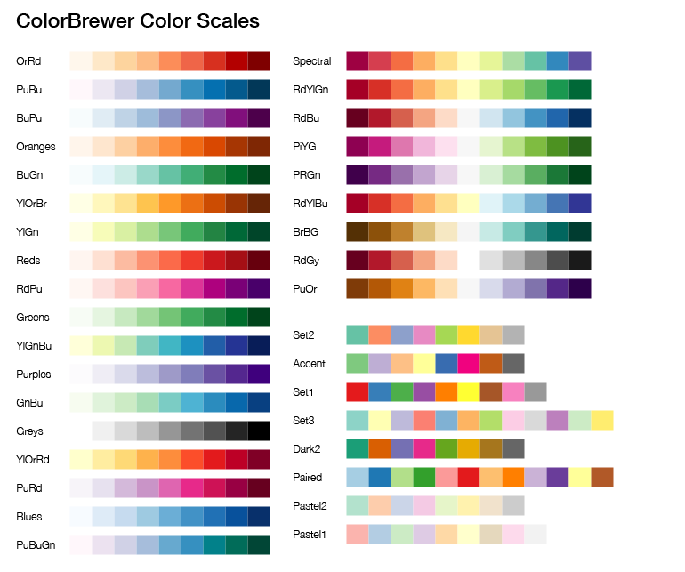

# Plotting Functions
MultiQC plotting functions are held within `multiqc.plots` submodules.
To use them, simply import the modules you want, eg.:
```python
from multiqc.plots import bargraph, linegraph
```

Once you've done that, you will have access to the corresponding plotting
functions:

```python
bargraph.plot()
linegraph.plot()
scatter.plot()
table.plot()
beeswarm.plot()
heatmap.plot()
```

These have been designed to work in a similar manner to each other - you
pass a data structure to them, along with optional extras such as categories
and configuration options, and they return a string of HTML to add to the
report. You can add this to the module introduction or sections as described
above. For example:
```python
self.add_section (
    name = 'Module Section',
    anchor = 'mymod_section',
    plot = bargraph.plot(self.parsed_data, categories, pconfig)
)
```

## Bar graphs
Simple data can be plotted in bar graphs. Many MultiQC modules make use
of stacked bar graphs. Here, the `bargraph.plot()` function comes to
the rescue. A basic example is as follows:
```python
from multiqc import plots
data = {
    'sample 1': {
        'aligned': 23542,
        'not_aligned': 343,
    },
    'sample 2': {
        'not_aligned': 7328,
        'aligned': 1275,
    }
}
html_content = bargraph.plot(data)
```

To specify the order of categories in the plot, you can supply a list of
dictionary keys. This can also be used to exclude a key from the plot.

```python
cats = ['aligned', 'not_aligned']
html_content = bargraph.plot(data, cats)
```

If `cats` is given as a dict instead of a list, you can specify a nice name
and a colour too. Make it an OrderedDict to specify the order:
```python
from collections import OrderedDict
cats = OrderedDict()
cats['aligned'] = {
    'name': 'Aligned Reads',
    'color': '#8bbc21'
}
cats['not_aligned'] = {
    'name': 'Unaligned Reads',
    'color': '#f7a35c'
}
```

Finally, a third variable can be supplied with configuration variables for
the plot. The defaults are as follows:
```python
config = {
    # Building the plot
    'id': '<random string>',                # HTML ID used for plot
    'cpswitch': True,                       # Show the 'Counts / Percentages' switch?
    'cpswitch_c_active': True,              # Initial display with 'Counts' specified? False for percentages.
    'cpswitch_counts_label': 'Counts',      # Label for 'Counts' button
    'cpswitch_percent_label': 'Percentages' # Label for 'Percentages' button
    'logswitch': False,                     # Show the 'Log10' switch?
    'logswitch_active': False,              # Initial display with 'Log10' active?
    'logswitch_label': 'Log10',             # Label for 'Log10' button
    'hide_zero_cats': True,                 # Hide categories where data for all samples is 0
    # Customising the plot
    'title': None,                          # Plot title
    'xlab': None,                           # X axis label
    'ylab': None,                           # Y axis label
    'ymax': None,                           # Max y limit
    'ymin': None,                           # Min y limit
    'yCeiling': None,                       # Maximum value for automatic axis limit (good for percentages)
    'yFloor': None,                         # Minimum value for automatic axis limit
    'yMinRange': None,                      # Minimum range for axis
    'yDecimals': True,                      # Set to false to only show integer labels
    'ylab_format': None,                    # Format string for x axis labels. Defaults to {value}
    'stacking': 'normal',                   # Set to None to have category bars side by side
    'use_legend': True,                     # Show / hide the legend
    'click_func': None,                     # Javascript function to be called when a point is clicked
    'cursor': None,                         # CSS mouse cursor type.
    'tt_decimals': 0,                       # Number of decimal places to use in the tooltip number
    'tt_suffix': '',                        # Suffix to add after tooltip number
    'tt_percentages': True,                 # Show the percentages of each count in the tooltip
}
```

### Switching datasets
It's possible to have single plot with buttons to switch between different
datasets. To do this, give a list of data objects (same formats as described
above). Also add the following config options to supply names to the buttons:
```python
config = {
    'data_labels': ['Reads', 'Bases']
}
```
You can also customise the y-axis label and min/max values for each dataset:
```python
config = {
    'data_labels': [
        {'name': 'Reads', 'ylab': 'Number of Reads'},
        {'name': 'Bases', 'ylab': 'Number of Base Pairs', 'ymax':100}
    ]
}
```
If supplying multiple datasets, you can also supply a list of category
objects. Make sure that they are in the same order as the data.

Categories should contain data keys, so if you're supplying a list of two datasets,
you should supply a list of two sets of keys for the categories. MultiQC will try to
guess categories from the data keys if categories are missing.

For example, with two datasets supplied as above:
```python
cats = [
    ['aligned_reads','unaligned_reads'],
    ['aligned_base_pairs','unaligned_base_pairs'],
]
```
Or with additional customisation such as name and colour:
```python
from collections import OrderedDict
cats = [OrderedDict(), OrderedDict()]
cats[0]['aligned_reads'] =        {'name': 'Aligned Reads',        'color': '#8bbc21'}
cats[0]['unaligned_reads'] =      {'name': 'Unaligned Reads',      'color': '#f7a35c'}
cats[1]['aligned_base_pairs'] =   {'name': 'Aligned Base Pairs',   'color': '#8bbc21'}
cats[1]['unaligned_base_pairs'] = {'name': 'Unaligned Base Pairs', 'color': '#f7a35c'}
```

### Interactive / Flat image plots
Note that the `bargraph.plot()` function can generate both interactive
JavaScript (HighCharts) powered report plots _and_ flat image plots made using
MatPlotLib. This choice is made within the function based on config variables
such as number of dataseries and command line flags.

Note that both plot types should come out looking pretty much identical. If
you spot something that's missing in the flat image plots, let me know.


## Line graphs
This base function works much like the above, but for two-dimensional
data, to produce line graphs. It expects a dictionary in the following format:
```python
from multiqc import plots
data = {
    'sample 1': {
        '<x val 1>': '<y val 1>',
        '<x val 2>': '<y val 2>',
    },
    'sample 2': {
        '<x val 1>': '<y val 1>',
        '<x val 2>': '<y val 2>',
    }
}
html_content = linegraph.plot(data)
```

Additionally, a config dict can be supplied. The defaults are as follows:
```python
from multiqc import plots
config = {
    # Building the plot
    'smooth_points': None,       # Supply a number to limit number of points / smooth data
    'smooth_points_sumcounts': True, # Sum counts in bins, or average? Can supply list for multiple datasets
    'id': '<random string>',     # HTML ID used for plot
    'categories': False,         # Set to True to use x values as categories instead of numbers.
    'colors': dict()             # Provide dict with keys = sample names and values colours
    'extra_series': None,        # See section below
    # Plot configuration
    'title': None,               # Plot title
    'xlab': None,                # X axis label
    'ylab': None,                # Y axis label
    'xCeiling': None,            # Maximum value for automatic axis limit (good for percentages)
    'xFloor': None,              # Minimum value for automatic axis limit
    'xMinRange': None,           # Minimum range for axis
    'xmax': None,                # Max x limit
    'xmin': None,                # Min x limit
    'xLog': False,               # Use log10 x axis?
    'xDecimals': True,           # Set to false to only show integer labels
    'yCeiling': None,            # Maximum value for automatic axis limit (good for percentages)
    'yFloor': None,              # Minimum value for automatic axis limit
    'yMinRange': None,           # Minimum range for axis
    'ymax': None,                # Max y limit
    'ymin': None,                # Min y limit
    'yLog': False,               # Use log10 y axis?
    'yDecimals': True,           # Set to false to only show integer labels
    'yPlotBands': None,          # Highlighted background bands. See http://api.highcharts.com/highcharts#yAxis.plotBands
    'xPlotBands': None,          # Highlighted background bands. See http://api.highcharts.com/highcharts#xAxis.plotBands
    'yPlotLines': None,          # Highlighted background lines. See http://api.highcharts.com/highcharts#yAxis.plotLines
    'xPlotLines': None,          # Highlighted background lines. See http://api.highcharts.com/highcharts#xAxis.plotLines
    'tt_label': '{point.x}: {point.y:.2f}', # Use to customise tooltip label, eg. '{point.x} base pairs'
    'pointFormat': None,         # Replace the default HTML for the entire tooltip label
    'click_func': function(){},  # Javascript function to be called when a point is clicked
    'cursor': None               # CSS mouse cursor type. Defaults to pointer when 'click_func' specified
    'reversedStacks': False      # Reverse the order of the category stacks. Defaults True for plots with Log10 option
}
html_content = linegraph.plot(data, config)
```

### Switching datasets
You can also have a single plot with buttons to switch between different
datasets. To do this, just supply a list of data dicts instead (same
formats as described above). Also add the following config options to
supply names to the buttons and graph labels:
```python
config = {
    'data_labels': [
        {'name': 'DS 1', 'ylab': 'Dataset 1'},
        {'name': 'DS 2', 'ylab': 'Dataset 2'}
    ]
}
```
All of these config values are optional, the function will default
to sensible values if things are missing. See the cutadapt module
plots for an example of this in action.

### Additional data series
Sometimes, it's good to be able to specify specific data series manually.
To do this, use `config['extra_series']`. For a single extra line this can
be a dict (as below). For multiple lines, use a list of dicts. For multiple
dataset plots, use a list of list of dicts.

For example, to add a dotted `x = y` reference line:
```python
from multiqc import plots
config = {
    'extra_series': {
        'name': 'x = y',
        'data': [[0, 0], [max_x_val, max_y_val]],
        'dashStyle': 'Dash',
        'lineWidth': 1,
        'color': '#000000',
        'marker': { 'enabled': False },
        'enableMouseTracking': False,
        'showInLegend': False,
    }
}
html_content = linegraph.plot(data, config)
```


## Scatter Plots
Scatter plots work in almost exactly the same way as line plots. Most (if not all)
config options are shared between the two. The data structure is similar but
not identical:

```python
from multiqc import plots
data = {
    'sample 1': {
        x: '<x val>',
        y: '<y val>'
    },
    'sample 2': {
        x: '<x val>',
        y: '<y val>'
    }
}
html_content = scatter.plot(data)
```

If you want more than one data point per sample, you can supply a list of
dictionaries instead. You can also optionally specify point colours and
sample name suffixes (these are appended to the sample name):
```python
data = {
    'sample 1': [
        { x: '<x val>', y: '<y val>', color: '#a6cee3', name: 'Type 1' },
        { x: '<x val>', y: '<y val>', color: '#1f78b4', name: 'Type 2' }
    ],
    'sample 2': [
        { x: '<x val>', y: '<y val>', color: '#b2df8a', name: 'Type 1' },
        { x: '<x val>', y: '<y val>', color: '#33a02c', name: 'Type 2' }
    ]
}
```

Remember that MultiQC reports can contain large numbers of samples, so this plot type
is **not** suitable for large quantities of data - 20,000 genes might look good
for one sample, but when someone runs MultiQC with 500 samples, it will crash
the browser and be impossible to interpret.

See the above docs about line plots for most config options. The scatter plot
has a handful of unique ones in addition:
```python
pconfig = {
    'marker_colour': 'rgba(124, 181, 236, .5)', # string, base colour of points (recommend rgba / semi-transparent)
    'marker_size': 5,               # int, size of points
    'marker_line_colour': '#999',   # string, colour of point border
    'marker_line_width': 1,         # int, width of point border
    'square': False                 # Force the plot to stay square? (Maintain aspect ratio)
}
```

## Creating a table
Tables should work just like the functions above (most like the bar
graph function). As a minimum, the function takes a dictionary containing
data - the first keys will be sample names (row headers) and each key
contained within will be a table column header.

You can also supply a list of key names to restrict the data in the table
to certain keys / columns. This also specifies the order that columns
should be displayed in.

For more customisation, the headers can be supplied as a dictionary. Each
key should match the keys used in the data dictionary, but values can
customise the output. If you want to specify the order of the columns, you
must use an `OrderedDict`.

Finally, a the function accepts a third parameter, a config dictionary.
This can set global options for the table (eg. a title) and can also hold
default values to customise the output of all table columns.

The default header keys are:
```python
single_header = {
    'namespace': '',                # Name for grouping in table
    'title': '[ dict key ]',        # Short title, table column title
    'description': '[ dict key ]',  # Longer description, goes in mouse hover text
    'max': None,                    # Minimum value in range, for bar / colour coding
    'min': None,                    # Maximum value in range, for bar / colour coding
    'scale': 'GnBu',                # Colour scale for colour coding. False to disable.
    'colour': '<auto>',             # Colour for column grouping
    'format': '{:,.1f}',            # Output format() string
    'shared_key': None              # See below for description
    'modify': None,                 # Lambda function to modify values
    'hidden': False                 # Set to True to hide the column on page load
}
```
A third parameter can be specified with settings for the whole table:
```python
table_config = {
    'namespace': '',                         # Module / section that table is in. Prepends header descriptions.
    'id': '<random string>',                 # ID used for the table
    'table_title': '<table id>',             # Title of the table. Used in the column config modal
    'save_file': False,                      # Whether to save the table data to a file
    'raw_data_fn':'multiqc_<table_id>_table' # File basename to use for raw data file
    'sortRows': True                         # Whether to sort rows alphabetically
    'col1_header': 'Sample Name'             # The header used for the first column
    'no_beeswarm': False    # Force a table to always be plotted (beeswarm by default if many rows)
}
```
Header keys such as `max`, `min` and `scale` can also be specified in the table config.
These will then be applied to all columns.

Colour scales are taken from [ColorBrewer2](http://colorbrewer2.org/). The following are available:


A very basic example is shown below:
```python
data = {
    'sample 1': {
        'aligned': 23542,
        'not_aligned': 343,
    },
    'sample 2': {
        'aligned': 1275,
        'not_aligned': 7328,
    }
}
table_html = table.plot(data)
```

A more complicated version with ordered columns, defaults and column-specific
settings:
```python
data = {
    'sample 1': {
        'aligned': 23542,
        'not_aligned': 343,
        'aligned_percent': 98.563952271
    },
    'sample 2': {
        'aligned': 1275,
        'not_aligned': 7328,
        'aligned_percent': 14.820411484
    }
}
headers = OrderedDict()
headers['aligned_percent'] = {
    'title': '% Aligned',
    'description': 'Percentage of reads that aligned',
    'suffix': '%',
    'max': 100,
}
headers['aligned'] = {
    'title': '{} Aligned'.format(config.read_count_prefix),
    'description': 'Aligned Reads ({})'.format(config.read_count_desc),
    'shared_key': 'read_count',
    'modify': lambda x: x * config.read_count_multiplier
}
config = {
    'namespace': 'My Module',
    'min': 0,
    'scale': 'GnBu'
}
table_html = table.plot(data, headers, config)
```

## Beeswarm plots (dot plots)
Beeswarm plots work from the exact same data structure as tables, so the
usage is just the same. Except instead of calling `table`, call `beeswarm`:
```python
data = {
    'sample 1': {
        'aligned': 23542,
        'not_aligned': 343,
    },
    'sample 2': {
        'not_aligned': 7328,
        'aligned': 1275,
    }
}
beeswarm_html = beeswarm.plot(data)
```
The function also accepts the same headers and config parameters.

## Heatmaps
Heatmaps expect data in the structure of a list of lists. Then, a list
of sample names for the x-axis, and optionally for the y-axis (defaults
to the same as the x-axis).
```python
heatmap.plot(data, xcats, ycats, pconfig)
```

A simple example:
```python
hmdata = [
    [0.9, 0.87, 0.73, 0.6, 0.2, 0.3],
    [0.87, 1, 0.7, 0.6, 0.9, 0.3],
    [0.73, 0.8, 1, 0.6, 0.9, 0.3],
    [0.6, 0.8, 0.7, 1, 0.9, 0.3],
    [0.2, 0.8, 0.7, 0.6, 1, 0.3],
    [0.3, 0.8, 0.7, 0.6, 0.9, 1],
]
names = [ 'one', 'two', 'three', 'four', 'five', 'six' ]
hm_html = heatmap.plot(hmdata, names)
```

Much like the other plots, you can change the way that the heatmap looks
using a config dictionary:

```python
pconfig = {
    'title': None,                 # Plot title
    'xTitle': None,                # X-axis title
    'yTitle': None,                # Y-axis title
    'min': None,                   # Minimum value (default: auto)
    'max': None,                   # Maximum value (default: auto)
    'square': True,                # Force the plot to stay square? (Maintain aspect ratio)
    'colstops': []                 # Scale colour stops. See below.
    'reverseColors': False,        # Reverse the order of the colour axis
    'decimalPlaces': 2,            # Number of decimal places for tooltip
    'legend': True,                # Colour axis key enabled or not
    'borderWidth': 0,              # Border width between cells
    'datalabels': True,            # Show values in each cell. Defaults True when less than 20 samples.
    'datalabel_colour': '<auto>',  # Colour of text for values. Defaults to auto contrast.
}
```

The colour stops are a bit special and can be used to define a custom colour
scheme. These should be defined as a list of lists, with a number between 0 and 1
and a HTML colour. The default is `RdYlBu` from [ColorBrewer](http://colorbrewer2.org/):
```python
pconfig = {
    'colstops' = [
        [0, '#313695'],
        [0.1, '#4575b4'],
        [0.2, '#74add1'],
        [0.3, '#abd9e9'],
        [0.4, '#e0f3f8'],
        [0.5, '#ffffbf'],
        [0.6, '#fee090'],
        [0.7, '#fdae61'],
        [0.8, '#f46d43'],
        [0.9, '#d73027'],
        [1, '#a50026'],
    ]
}
```

## Javascript Functions
The javascript bundled in the default MultiQC template has a number of
helper functions to make your life easier.

> NB: The MultiQC Python functions make use of these, so it's very unlikely
> that you'll need to use any of this. But it's here for reference.

### Plotting line graphs
`plot_xy_line_graph (target, ds)`

Plots a line graph with multiple series of (x,y) data pairs. Used by
the [linegraph.plot()](http://multiqc.info/docs/#line-graphs)
python function.

Data and configuration must be added to the document level
`mqc_plots` variable on page load, using the target as the key.
The variables used are as follows:
```javascript
mqc_plots[target]['plot_type'] = 'xy_line';
mqc_plots[target]['config'];
mqc_plots[target]['datasets'];
```

Multiple datasets can be added in the `['datasets']` array. The supplied
variable `ds` specifies which is plotted (defaults to `0`).

Available config options with default vars:
```javascript
config = {
    title: undefined,            // Plot title
    xlab: undefined,             // X axis label
    ylab: undefined,             // Y axis label
    xCeiling: undefined,         // Maximum value for automatic axis limit (good for percentages)
    xFloor: undefined,           // Minimum value for automatic axis limit
    xMinRange: undefined,        // Minimum range for axis
    xmax: undefined,             // Max x limit
    xmin: undefined,             // Min x limit
    xDecimals: true,             // Set to false to only show integer labels
    yCeiling: undefined,         // Maximum value for automatic axis limit (good for percentages)
    yFloor: undefined,           // Minimum value for automatic axis limit
    yMinRange: undefined,        // Minimum range for axis
    ymax: undefined,             // Max y limit
    ymin: undefined,             // Min y limit
    yDecimals: true,             // Set to false to only show integer labels
    yPlotBands: undefined,       // Highlighted background bands. See http://api.highcharts.com/highcharts#yAxis.plotBands
    xPlotBands: undefined,       // Highlighted background bands. See http://api.highcharts.com/highcharts#xAxis.plotBands
    tt_label: '{point.x}: {point.y:.2f}', // Use to customise tooltip label, eg. '{point.x} base pairs'
    pointFormat: undefined,      // Replace the default HTML for the entire tooltip label
    click_func: function(){},    // Javascript function to be called when a point is clicked
    cursor: undefined            // CSS mouse cursor type. Defaults to pointer when 'click_func' specified
}
```

An example of the markup expected, with the function being called:
```html
<div id="my_awesome_line_graph" class="hc-plot"></div>
<script type="text/javascript">
    mqc_plots['#my_awesome_bar_plot']['plot_type'] = 'xy_line';
    mqc_plots['#my_awesome_line_graph']['datasets'] = [
        {
            name: 'Sample 1',
            data: [[1, 1.5], [1.5, 3.1], [2, 6.4]]
        },
        {
            name: 'Sample 2',
            data: [[1, 1.7], [1.5, 4.3], [2, 8.4]]
        },
    ];
    mqc_plots['#my_awesome_line_graph']['config'] = {
        "title": "Best Plot Ever",
        "ylab": "Pings",
        "xlab": "Pongs"
    };
    $(function () {
        plot_xy_line_graph('#my_awesome_line_graph');
    });
</script>
```

### Plotting bar graphs
`plot_stacked_bar_graph (target, ds)`

Plots a bar graph with multiple series containing multiple categories.
Used by the [bargraph.plot()](http://multiqc.info/docs/#bar-graphs)
python function.

Data and configuration must be added to the document level
`mqc_plots` variable on page load, using the target as the key.
The variables used are as follows:
```javascript
mqc_plots[target]['plot_type'] = 'bar_graph';
mqc_plots[target]['config'];
mqc_plots[target]['datasets'];
mqc_plots[target]['samples'];
```

All available config options with default vars:
```javascript
config = {
    title: undefined,           // Plot title
    xlab: undefined,            // X axis label
    ylab: undefined,            // Y axis label
    ymax: undefined,            // Max y limit
    ymin: undefined,            // Min y limit
    yDecimals: true,            // Set to false to only show integer labels
    ylab_format: undefined,     // Format string for x axis labels. Defaults to {value}
    stacking: 'normal',         // Set to null to have category bars side by side (None in python)
    xtype: 'linear',            // Axis type. 'linear' or 'logarithmic'
    use_legend: true,           // Show / hide the legend
    click_func: undefined,      // Javascript function to be called when a point is clicked
    cursor: undefined,          // CSS mouse cursor type. Defaults to pointer when 'click_func' specified
    tt_percentages: true,       // Show the percentages of each count in the tooltip
    reversedStacks: false,      // Reverse the order of the categories in the stack.
}
```

An example of the markup expected, with the function being called:
```html
<div id="my_awesome_bar_plot" class="hc-plot"></div>
<script type="text/javascript">
    mqc_plots['#my_awesome_bar_plot']['plot_type'] = 'bar_graph';
    mqc_plots['#my_awesome_bar_plot']['samples'] = ['Sample 1', 'Sample 2']
    mqc_plots['#my_awesome_bar_plot']['datasets'] = [{"data": [4, 7], "name": "Passed Test"}, {"data": [2, 3], "name": "Failed Test"}]
    mqc_plots['#my_awesome_bar_plot']['config'] = {
        "title": "My Awesome Plot",
        "ylab": "# Observations",
        "ymin": 0,
        "stacking": "normal"
    };
    $(function () {
        plot_stacked_bar_graph("#my_awesome_bar_plot");
    });
</script>
```

### Switching counts and percentages
If you're using the plotting functions above, it's easy to add a button which
switches between percentages and counts. Just add the following HTML above
your plot:
```html
<div class="btn-group switch_group">
    <button class="btn btn-default btn-sm active" data-action="set_numbers" data-target="#my_plot">Counts</button>
    <button class="btn btn-default btn-sm" data-action="set_percent" data-target="#my_plot">Percentages</button>
</div>
```
_NB:_ This markup is generated automatically with the Python `self.plot_bargraph()` function.


### Switching plot datasets
Much like the counts / percentages buttons above, you can add a button which
switches the data displayed in a single plot. Make sure that both datasets
are stored in named javascript variables, then add the following markup:
```html
<div class="btn-group switch_group">
    <button class="btn btn-default btn-sm active" data-action="set_data" data-ylab="First Data" data-newdata="data_var_1" data-target="#my_plot">Data 1</button>
    <button class="btn btn-default btn-sm" data-action="set_data" data-ylab="Second Data" data-newdata="data_var_2" data-target="#my_plot">Data 2</button>
</div>
```
Note the CSS class `active` which specifies which button is 'pressed' on page load.
`data-ylab` and `data-xlab` can be used to specify the new axes labels.
`data-newdata` should be the name of the javascript object with the new data
to be plotted and `data-target` should be the CSS selector of the plot to change.

### Custom event triggers
Some of the events that take place in the general javascript
code trigger jQuery events which you can hook into from within your
module's code. This allows you to take advantage of events generated
by the global theme whilst keeping your code modular.

```javascript
$(document).on('mqc_highlights', function(e, f_texts, f_cols, regex_mode){
    // This trigger is called when the highlight strings are
    // updated. Three variables are given - an array of search
    // strings (f_texts), an array of colours with corresponding
    // indexes (f_cols) and a boolean var saying whether the
    // search should be treated as a string or a regex (regex_mode)
});

$(document).on('mqc_renamesamples', function(e, f_texts, t_texts, regex_mode){
    // This trigger is called when samples are renamed
    // Three variables are given - an array of search
    // strings (f_texts), an array of replacements with corresponding
    // indexes (t_texts) and a boolean var saying whether the
    // search should be treated as a string or a regex (regex_mode)
});

$(document).on('mqc_hidesamples', function(e, f_texts, regex_mode){
    // This trigger is called when the Hide Samples filters change.
    // Two variables are given - an array of search strings
    // (f_texts) and a boolean saying whether the search should
    // be treated as a string or a regex (regex_mode)
});

$('#YOUR_PLOT_ID').on('mqc_plotresize', function(){
    // This trigger is called when a plot handle is pulled,
    // resizing the height
});

$('#YOUR_PLOT_ID').on('mqc_original_series_click', function(e, name){
    // A plot able to show original images has had a point clicked.
    // 'name' contains the name of the series that was clicked
});

$('#YOUR_PLOT_ID').on('mqc_original_chg_source', function(e, name){
    // A plot with original images has had a request to change the
    // original image source (eg. pressing Prev / Next)
});
```
