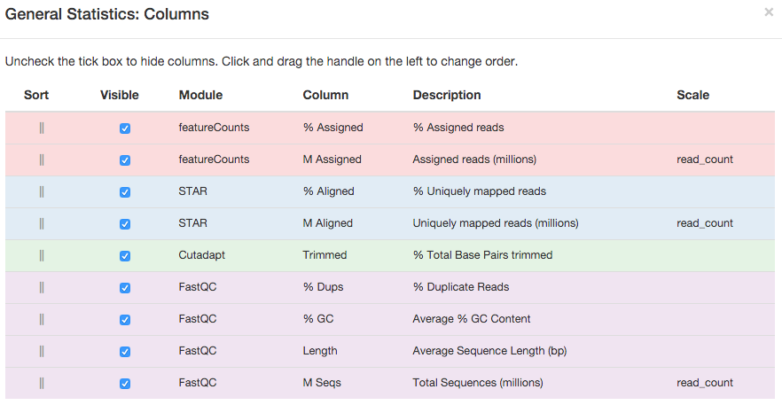
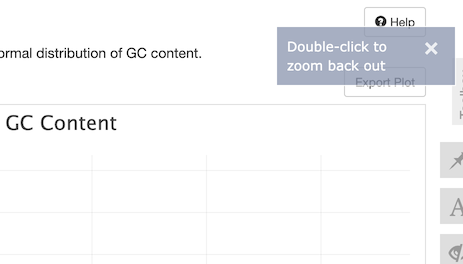
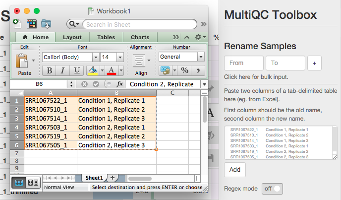

# Using MultiQC Reports
Once MultiQC has finished, you should have a HTML report file called
`multiqc_report.html` (or something similar, depending on how you ran MultiQC).
You can launch this report with `open multiqc_report.html` on the command
line, or double clicking the file in a file browser.

## Browser compatibility
MultiQC reports should work in any modern browser. They have been tested
using OSX Chrome, Firefox and Safari. If you find any report bugs, please
report them as a [GitHub issue](https://github.com/ewels/MultiQC/issues).

## Report layout
MultiQC reports have three main page sections:

 - The navigation menu (left side)
   - Links to the different module sections in the report
   - Click the logo to go to the top of the page
 - The toolbox (right side)
   - Contains various tools to modify the report data (see below)
 - The report (middle)
   - This is what you came here for, the data!

Note that if you're viewing the report on a mobile device / small window,
the content will be reformatted to fit the screen.

## Report tour
The easiest way to get to grips with MultiQC reports is to use the tour,
bundled with every report using the `default` template. You should see
a button to launch this at the top of the report:

This will walk you through the different parts of the report, demonstrating
the available features.

## General Statistics table
At the top of every MultiQC report is the 'General Statistics' table.
This shows an overview of key values, taken from all modules. The aim
of the table is to bring together stats for each sample from across the
analysis so that you can see it in one place.

Hovering over column headers will show a longer description, including which
module produced the data. Clicking a header will sort the table by that value.
Clicking it again will change the sort direction. You can shift-click multiple
headers to sort by multiple columns.

Above the table there is a button called 'Configure Columns'. Clicking this
will launch a modal window with more detailed information about each column,
plus options to show/hide and change the order of columns.

You can manually reorder the rows in the table by clicking and dragging the
handle at the left side of a row.

## Plots
MultiQC modules can take plot more extensive data in the sections below
the general statistics table. These plotting use the
[HighCharts](http://www.highcharts.com/) JavaScript library.

### Interactive plots
All plots are interactive - hove the mouse over data to see a tooltip with
more information about that dataset. Clicking and dragging on line graphs
will zoom into that area.

To reset the zoom, use the button in the top right:

Plots have a grey bar along their base; clicking and dragging this will
resize the plot's height:

### Exporting plots
If you want to use the plot elsewhere (_eg._ in a presentation or paper),
you can export it in a range of formats. Just click the menu button in
the top right of the plot:

This gives a range of options. PDF and SVG outputs are in a vector format,
so can be edited in tools such as
[Adobe Illustrator](http://www.adobe.com/products/illustrator.html) or
the free tool [Inkscape](https://inkscape.org/en/). This makes them ideal
for use in publications.

### Dynamic plots
Some plots have buttons above them which allow you to change the data
that they show or their axis. For example, many bar plots have the option
to show the data as percentages instead of counts:

## Toolbox
MultiQC reports come with a 'toolbox', accessible by clicking the buttons
on the right hand side of the report:

Active toolbox panels have their button highlighted with a blue outline.
You can hide the toolbox by clicking the open panel button a second time,
or pressing `Escape` on your keyboard.

### Highlight Samples
If you run MultiQC plots with a lot of samples, plots can become very
data-heavy. This makes it difficult to find specific samples, or subsets
of samples.

To help with this, you can use the Highlight Samples tool to colour datasets
of interest. Simply enter some text which will match the samples you want to
highlight and press enter (or click the add button). If you like, you can also
customise the highlight colour.

To make it easier to match groups of samples, you can use a regular expressions
by turning on 'Regex mode'. You can test regexes using a nice tool at
[regex101.com](https://regex101.com/). See a nice introduction to regexes
[here](http://www.regular-expressions.info/quickstart.html). Note that pattern
delimiters are not needed (use `pattern`, not `/pattern/`).

Here, we highlight any sample names that end in `_1`:

Note that a new button appears above the General Statistics table when samples
are highlighted, allowing you to sort the table according to highlights.

Search patterns can be changed after creation, just click to edit. To remove,
click the grey cross on the right hand side.

Searching for an empty string will match all samples.

### Renaming Samples
Sample names are typically generated based on processed file names. These
file names are not always informative. To help with this, you can do a search
and replace within sample names. Here, we remove the `SRR1067` and `_1` parts
of the sample names, which are the same for all samples:

Again, regular expressions can be used. See above for details. Note that
regex groups can be used - define a group match with parentheses and
use the matching value with `$1`, `$2` etc. For example - a search string
`SRR283(\d{3})` and replace string `$1_SRR283` would move the final three
digits of matching sample names to the start of the name.

Often, you may have a spreadsheet with filenames and informative sample
names. To avoid having to manually enter each name, you can paste from a
spreadsheet using the 'bulk import' tool:

### Hiding Samples
Sometimes, you want to focus on a subset of samples. To temporarily
hide samples from the report, enter a search string as described above into
the 'Hide Samples' toolbox panel.

Here, we hide all samples with `_trimmed` in their sample name:
_(Note that plots will tell you how many samples have been hidden)_

### Save Settings
To avoid having to re-enter the same toolbox setup repeatedly, you can
save your settings using the 'Save Settings' panel. Just pick a name
and click save. To load, choose your set of settings and press load 
(or delete). Loaded settings are applied on top of current settings.
All configs are saved in browser local storage - they do not travel
with the report and may not work in older browsers.

